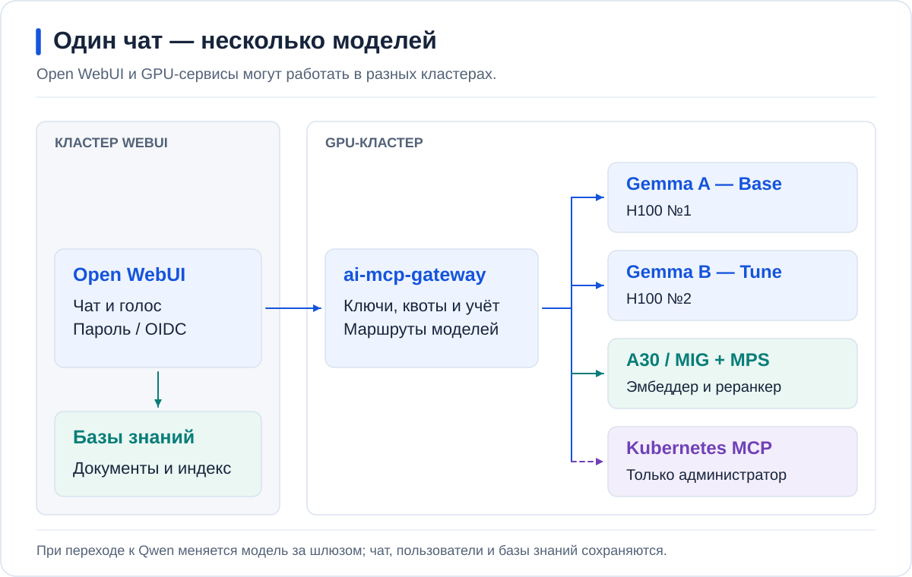
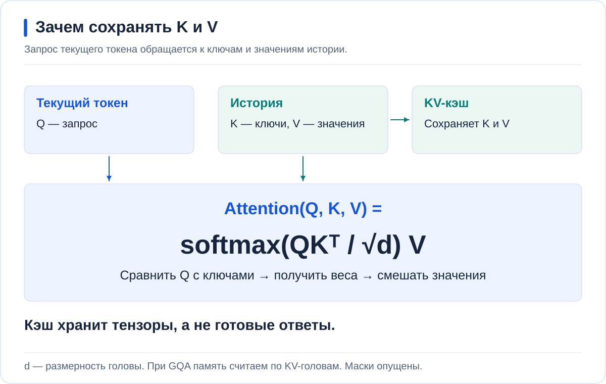
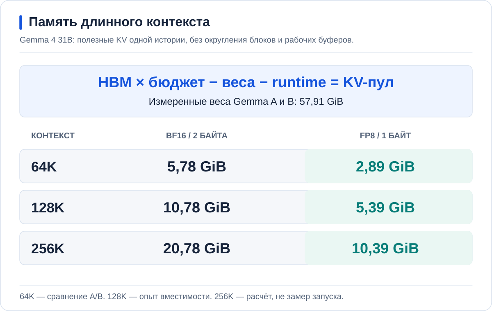
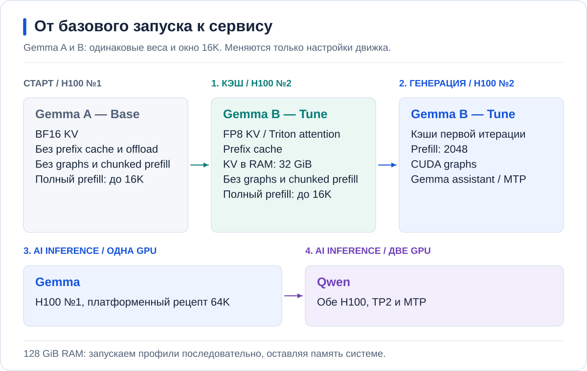
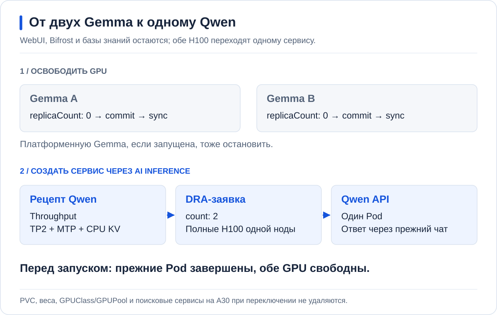
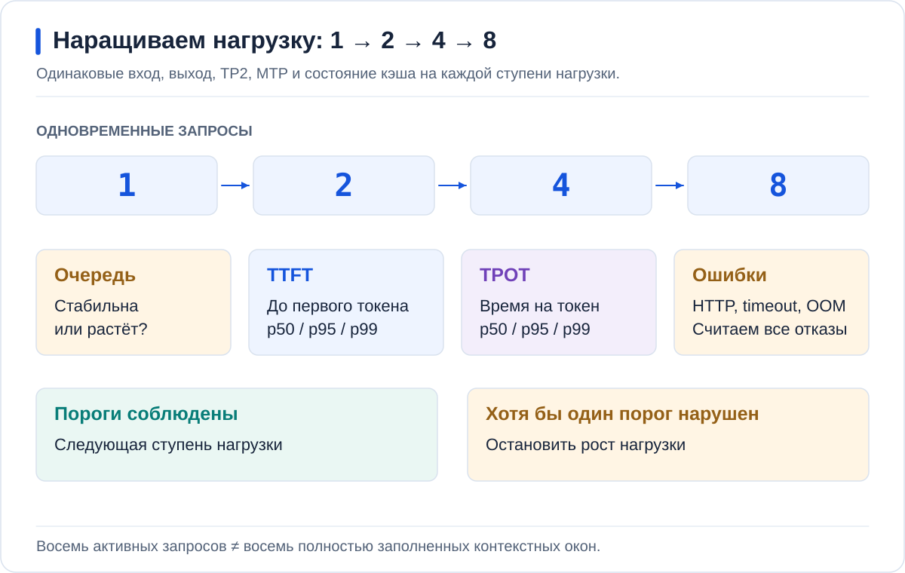

<p align="center">
  <a href="https://github.com/aleksandr-podmoskovniy/hardfest-gpu-workshop">
    
  </a>
</p>

# Инференс без простоя GPU: чиним LLM-сервис руками и делим карту на живом кластере

Александр Подмосковный, Флант / Deckhouse Platform

Один и тот же запрос может долго ждать первого токена, медленно генерироваться
или стоять в очереди. Разберём эти причины на Gemma: изменим хранение KV,
затем обработку запросов. После ручной настройки перенесём запуск в AI Inference,
разместим три небольших сервиса на A30 и запустим Qwen на двух H100.

Все этапы используют один чат, ai-mcp-gateway и один набор графиков.
Параметры меняются через Helm values в Git, приложения синхронизирует Argo CD.

**Запасной стенд:** [полный сценарий на двух RTX 5060 Ti](RTX5060.md) —
те же оптимизации, Gemma с assistant и Qwen TP2 с MTP, но компактные модели.

<a id="contents"></a>
## Содержание

- [Стенд и подключение](#topology), [чат и доступ](#chat)
- [Подготовка окружения](#setup), [дашборд](#monitoring)
- [1. Где теряется время](#latency)
- [2. Что занимает память GPU](#memory)
- [3. Gemma A: базовый запуск](#ab)
- [4. Первая итерация: prefix cache и KV в RAM](#ram)
- [5. Вторая итерация: chunked prefill и speculative decoding](#speculation)
- [6. Gemma через AI Inference](#platform)
- [7. Три сервиса на A30: эмбеддер, реранкер, Whisper](#placement)
- [8. Qwen через AI Inference на двух H100](#tp2)
- [Остановка](#cleanup), [результаты](#results)

Команды каждого опыта находятся в лабораторной работе под соответствующей схемой.
Долгая загрузка весов и первичная индексация выполняются до начала; время
перезапуска профилей нужно измерить на своём стенде.

<a id="topology"></a>
## Стенд и подключение



| Место | Что здесь работает |
| --- | --- |
| Управляющий кластер | Argo CD читает частный GitLab k8s-config |
| Кластер с A30 | Open WebUI, эмбеддер и реранкер в одной MIG-партиции через MPS; Whisper во второй |
| Кластер с двумя H100 | Ручные Gemma, затем сервисы AI Inference; ai-mcp-gateway на базе Bifrost |

Управляющий кластер может совпадать с кластером A30.
Между WebUI, шлюзом и API моделей нужны маршрутизация и TLS.
Доступность API не означает доступность Kubernetes MCP: у него отдельная авторизация.

<a id="chat"></a>
### Один чат на всех этапах

| Название в Open WebUI | Назначение |
| --- | --- |
| `Gemma A — Base` | Ручной запуск без исследуемых оптимизаций |
| `Gemma B — Tune` | Последовательно обновляемый ручной профиль B |
| `Gemma A — DP` | Gemma, созданная через AI Inference |
| `Qwen — TP2` | Финальный сервис на двух H100 |

`DP` здесь — метка платформенного запуска, не Data Parallel.
Каждая модель подключается отдельным маршрутом Bifrost: без балансировки A↔B,
fallback между ними и кэша готовых ответов.

Участник регистрируется с паролем и ждёт одобрения. После одобрения ему
автоматически выдаётся личный Virtual Key. Демонстрационный бюджет — $500 на 24 часа,
тариф чата — $10 за миллион входных и $20 за миллион выходных токенов.
Реальных списаний нет. Администратор входит по OIDC и использует отдельное
MCP-подключение с правами на целевой кластер.

Настройка бюджета не равна проверке его соблюдения: в текущем прогоне обнаружен
недосчёт общего HA-счётчика. [Результат и проверка лимита](docs/CHAT_AND_ACCESS.md#проверить-выдачу-и-отзыв).

Проверка выдачи, запретов, расхода и отзыва описана в
[подключении чата](docs/CHAT_AND_ACCESS.md). Участникам доступны базы знаний
и голос, но не Kubernetes MCP. Фоновая индексация и голосовой API требуют
отдельного учёта: личный VK чата не персонализирует их автоматически.

<a id="setup"></a>
## Подготовка окружения


Нужны Git, Helm 3 и kubectl. Все привязки площадки и секреты остаются вне
публичного репозитория. Образы закреплены по digest; ручные профили используют
vLLM 0.31.0. AI Inference должен поставлять совместимый runtime этой же версии.

1. Пройдите [подготовку стенда](docs/SETUP.md): GPU, RAM, каталоги моделей, runtime.
2. Скопируйте чарты и profiles в частный k8s-config по [инструкции GitOps](docs/GITOPS.md).
3. Заполните реальные контексты, классы GPU, источники моделей и маршруты.
4. Проверьте Helm render и server-side dry-run. Все публичные workloads выключены.
5. Применяйте только нужный Application и точный коммит; push без sync ничего не запускает.

Команды ниже и в лабораторных работах используют переменные из этой подготовки:

```bash
export ARGO_CONTEXT=management
export GPU_CONTEXT=gpu-cluster
export MIG_CONTEXT=a30-cluster
export ARGO_NAMESPACE=argocd
export DEMO_DIR=argo-projects/gpu-cluster/hardfest-demo
export A30_DIR=argo-projects/a30-cluster/hardfest-demo
```

Это условные имена: замените их на свои. Каждая команда kubectl явно указывает
контекст. Не переключайте глобальный current-context во время опыта.

Веса для ручного vLLM и AI Inference можно брать из одного ai-models.
В режиме NodeCache артефакт должен быть готов **на назначенной GPU-ноде**.
Контейнерный образ vLLM скачивается отдельно от весов; NodeCache не заменяет
кеш OCI-образов. Импорт — в [каталоге моделей](catalog/README.md).

<a id="monitoring"></a>
### Дашборд открывается до первого запроса

Установите [мониторинг](docs/OBSERVABILITY.md) и откройте **AI Inference / Service performance**
в каждом кластере с GPU. Выберите сервис и модель. Проверьте ненулевой scrape
и рост счётчиков после одного запроса.

На протяжении работы нужны четыре группы графиков:

- TTFT, время между токенами, входные и выходные токены/с;
- очередь, активные запросы и ошибки;
- KV, prefix cache, переносы KV между GPU и RAM;
- GPU/SM, HBM и память контейнера; на A30 — соответствие MIG-партициям.

Отсутствующая метрика — не нулевой расход. В разных runtime и KV-backend
имена и смысл метрик могут отличаться; таблица соответствий есть в инструкции.

<a id="latency"></a>
## 1. Где теряется время


TTFT — время до первого токена. Оно включает ожидание, подготовку запроса
и prefill. Скорость генерации после первого токена — другая характеристика.
Большое число токенов/с у всего сервиса ещё не означает быстрый ответ одному человеку.

Сначала отправьте короткий запрос через чат, затем длинный через benchmark.
Сопоставьте TTFT, очередь и decode на одном временном интервале.
Методику и ограничения p95 смотрите в [измерениях](docs/MEASUREMENTS.md).

<a id="memory"></a>
## 2. Что занимает память GPU



### Откуда берётся формула

При генерации нового токена его query обращается к ключам **K** предыдущих
токенов и смешивает соответствующие значения **V**. Сохраняем K/V, чтобы не
вычислять их заново на каждом шаге. Это состояние истории; веса модели от
добавления токенов не растут.


У одного токена в одном слое два набора векторов: `2 × Hkv × D` элементов.
Умножаем на размер элемента `b`, число токенов `S`, число одинаковых слоёв `L`
и число независимых историй `B`. Получаем байты, не гигабайты.

| Обозначение | Что подставлять |
| --- | --- |
| `Hkv` | Количество **KV-голов**, не query-голов `num_attention_heads` |
| `D` | Размерность одной KV-головы; не угадываем её по размеру hidden state |
| `b` | Байты на элемент KV: BF16/FP16 — 2, FP8 — 1; точность весов задаётся отдельно |
| `S` | Токены входа **плюс** уже сгенерированные токены; для верхней оценки — их суммарный предел |
| `L` | Слои, хранящие собственные K/V |
| `B` | Одновременно живущие независимые истории одинаковой длины; при разных длинах складываем их расходы |

Эта первая формула предполагает full attention и одинаковые слои. У Gemma
архитектура сложнее: full-слои видят всю историю, sliding-слои — только своё окно.
Поэтому считаем два слагаемых. Общий префикс пока не разделяем между запросами —
его переиспользование проверим отдельным опытом.

### Подставляем Gemma 4 31B

В [закреплённом config.json](https://huggingface.co/google/gemma-4-31B-it/blob/842da3794eaa0b77d5f08bae87a17459d91ff475/config.json)
открываем `text_config`, а не конфигурацию vision-энкодера:

| Слои | Число | KV-голов | Размерность | Сколько токенов сохраняем |
| --- | ---: | ---: | ---: | --- |
| Full attention | 10 | 4 | 512 | `S` |
| Sliding attention | 50 | 16 | 256 | `min(S, 1024)` |


Считаем **одну историю 16K в BF16**, соответствующую пределу начального A/B:

1. Full: `2 × 2 × 10 × 4 × 512 × 16384` = **1,25 GiB**.
2. Sliding: `2 × 2 × 50 × 16 × 256 × 1024` = **0,78125 GiB**.
3. Всего: **2,03125 GiB**. Для четырёх независимых историй такой длины — **8,125 GiB**.

Проверка обычным `awk`; меняем `S`, `B` и `b`, не параметры архитектуры:

```bash
awk -v S=16384 -v B=4 -v b=2 'BEGIN {
  W = S < 1024 ? S : 1024
  full = 2*b*10*4*512*S / 1073741824
  local = 2*b*50*16*256*W / 1073741824
  printf "Full %.5f + sliding %.5f = %.5f GiB/history; %d histories = %.5f GiB\n", full, local, full+local, B, B*(full+local)
}'
```

При `b=1` полезный объём FP8 вдвое меньше. При удвоении `S` после 1024 токенов
растёт только full-слагаемое, а не вся сумма. Флаг `attention_k_eq_v` не убирает
множитель 2: выбранный vLLM хранит K и V отдельно — после нормализации и RoPE это
не просто одна копия. [Реализация Gemma в vLLM 0.31](https://github.com/vllm-project/vllm/blob/v0.31.0/vllm/model_executor/models/gemma4.py).



### Сверяем расчёт с движком

Посчитали **полезные KV**, но vLLM выделяет пул блоков заранее. В нём есть свободные
блоки, округление и накладные расходы размещения разных типов attention. Prefill
требует рабочих буферов; длинный вход без chunking способен не поместиться, даже
если KV по формуле мал. Для assistant нужен ещё собственный бюджет.

После запуска A выпишите из логов размер GPU KV-пула и объявленную вместимость
в токенах. Затем отправьте один запрос, длинный запрос и четыре параллельных;
на дашборде сопоставьте занятость KV-пула, очередь и preemption. `nvidia-smi`
показывает всю занятую память, а не только KV этих четырёх историй.
[Команды проверки и разбор расхождения](docs/MEMORY_BUDGET.md#verify-kv).

**До включения оптимизаций объясните:** что изменится от FP8, удвоения контекста
и общего префикса? FP8 уменьшает байты на элемент; длина увеличивает full-KV;
одинаковый префикс позволяет разделить уже вычисленные блоки. Ни один из этих
механизмов не превращает RAM в продолжение HBM и не уменьшает размер весов.

<a id="ab"></a>
## 3. Gemma A: базовый запуск



Запустите `values/gemma-a.yaml` через Helm/Argo по [лабораторной 1](labs/01-ab.md).
У A выключены prefix cache, chunked prefill, CUDA graphs, KV-offload и speculative
decoding. Это контролируемое отключение механизмов в vLLM 0.31, не эмуляция старой версии.

Начальное окно A и B — **16 384 токена**. Строгий baseline без chunked prefill
требует большого рабочего буфера: поэтому не обещаем ему прежние 64K.
Для сравнения задаём 8192 входных и 2048 выходных токенов, 8 запросов,
concurrency 4; фактические длины сохраняем вместе с результатом.

Новые версии vLLM уже включают часть оптимизаций по умолчанию. Мы отключаем их
явно, чтобы отдельно увидеть эффект. В рабочем сервисе prefix cache полезен
при повторяющемся префиксе, но не даёт того же выигрыша на уникальных историях.

<a id="ram"></a>
## 4. Первая итерация: prefix cache и KV в RAM


На второй H100 запустите `values/gemma-b.yaml`. Пока окно остаётся 16K,
chunked prefill и CUDA graphs выключены. Включаем prefix cache, FP8 для KV
и CPU-пул 32 GiB:

```yaml
kv-transfer-config:
  kv_connector: OffloadingConnector
  kv_role: kv_both
  kv_connector_extra_config:
    cpu_bytes_to_use: 34359738368
```


Два разных опыта: сначала повтор одного префикса, затем несколько независимых
префиксов и возврат к первому после вытеснения из GPU.
Рост CPU-пула без обратной загрузки ещё не доказывает reuse из RAM.

Выполните [лабораторную 2](labs/02-kv-ram.md). Фиксируйте загрузку/сохранение
блоков и задержки, а не только более быстрый повтор.
Если RAM не хватает двум процессам, остановите A через Git и пометьте замер B
как последовательный. Не сравнивайте его с одновременным A/B без оговорки.

<a id="speculation"></a>
## 5. Вторая итерация: chunked prefill и speculative decoding


Переключите **тот же Application B** на `values/gemma-b-spec.yaml`.
Профиль сохраняет prefix cache, FP8 KV и 32 GiB CPU KV.
Добавляет prefill по 2048 токенов, CUDA graphs и отдельную Gemma assistant.


Assistant должен быть импортирован и доступен в том же Pod.
Проверяйте acceptance rate, TTFT и decode на одинаковых запросах:
накладные расходы проверки могут оказаться больше выигрыша.

В [лабораторной 3](labs/03-speculation.md) есть переключение, контроль конфигурации
и замер. Окно A/B здесь всё ещё 16K.

### Затем — отдельная проверка большего контекста

Сохранив все настройки второй итерации, увеличьте только окно B:
сначала 65 536, затем 131 072 токена. Это опыт на вместимость, а не сравнение
скорости с A. Для длинного запроса оставляйте место под ответ.

```yaml
vllm:
  max-model-len: 131072
```

Меняйте поле в скопированном профиле, не подменяйте его другим набором flags.
Зафиксируйте KV-пул, расход RAM и успешный длинный ответ. Верните
`max-model-len: 16384` перед повторным сравнением A/B.
Подробности — [расширение окна](labs/02-kv-ram.md#отдельный-опыт-большее-окно-после-второй-итерации).

<a id="platform"></a>
## 6. Gemma через AI Inference


Теперь переносим ответственность за запуск: Model из ai-models, разрешённый
DeviceClass и стратегия задают заказ; AI Inference выбирает рецепт и создаёт workload.

Проверьте план до освобождения GPU. Затем остановите ручную A на первой H100
и включите `platform/gemma.yaml` через чарт `charts/inference-service`.
Ручная B пока остаётся на второй карте.

Актуальный базовый рецепт Gemma 64K включает FP8 KV, prefix cache, chunked prefill
и CUDA graphs. CPU KV и assistant из ручного опыта нужно проверять в выбранном
рецепте отдельно: стандартный 64K-профиль не следует выдавать за их полный перенос.
Сравнение ручного и платформенного запуска требует одинаковой эффективной конфигурации.

Сервис `hf-platform-gemma` подключите отдельным маршрутом `Gemma A — DP`.
Проверьте Model → план → claim → workload → ответ API → ответ в чате.
[Лабораторная 4](labs/04-deckhouse.md) содержит проверки и короткий вариант:
ручная A через Helm против платформенной B.

<a id="placement"></a>
## 7. Три сервиса на A30


| Сервис | Модель | Размещение |
| --- | --- | --- |
| Эмбеддер | Qwen3 Embedding 4B, W4A16 | Первая 2g.12gb, MPS |
| Реранкер | Qwen3 Reranker 4B, W4A16, sequence classification | Та же партиция, MPS |
| Голос | Whisper large-v3 | Вторая 2g.12gb, отдельно |

Это три **InferenceService в кластере A30**, а не три ручных Deployment
и не объекты в консоли H100-кластера. MIG разделяет ресурсы аппаратно;
MPS делит вычисления внутри партиции, но не превращает процессы в отдельные GPU.


Подготовьте модели через `catalog/a30.yaml`, заказы — через
`platform/embedding.yaml`, `platform/reranker.yaml`, `platform/whisper.yaml`.
Проверьте реальные embeddings, ранжирование и транскрипцию по
[лабораторной 5](labs/05-mig-mps.md), затем подключите их в WebUI.

При смене Gemma на Qwen индекс сохраняется. При смене эмбеддера индекс
нужно перестроить с сохранением документов и ACL.
Контролируйте A30 отдельным datasource дашборда.

<a id="tp2"></a>
## 8. Qwen через AI Inference на двух H100



Qwen — обязательный финальный этап. Сначала проверьте готовность его артефакта,
runtime, рецепта и класса; затем освободите обе H100 через GitOps.
Уже работающие сервисы A30 и чат остаются включёнными.

Заказ `platform/qwen.yaml` создаёт `hf-qwen-platform`.
В плане должно быть `acceleratorCount=2`, в DRA claim — две разные карты
одной ноды, в конфигурации движка — `tensor-parallel-size: 2`.
Один DeviceClass без требуемого количества карт не подтверждает TP2.


[Лабораторная 6](labs/06-tp2.md) проверяет размещение, эффективные параметры,
`/v1/models`, законченный ответ `/v1/chat/completions`, затем путь через
Virtual Key и WebUI. Наличие NVLink в топологии само по себе не доказывает
скорость реального обмена.


У Qwen MTP встроен в модель: отдельная Gemma assistant ему не нужна.
Проверяем включённый MTP, статистику принятия предложений и decode.
Для этого рецепта применяется native KV-offload с Simple CPU backend;
не копируйте в него Gemma OffloadingConnector.



Сначала один короткий запрос, затем concurrency 4 и 8 с контролем ошибок.
Длинный контекст проверяется отдельно. Число запросов в очереди,
`max-num-seqs` и число полных окон, помещающихся в KV, — разные величины.

Добавьте Qwen в разрешённые модели действующих VK без обнуления расхода.
В WebUI скройте остановленные Gemma. Администратор проверяет MCP через OIDC
сначала чтением, затем изменением одного тестового ресурса с откатом.

<a id="cleanup"></a>
## Остановка

Сначала скройте останавливаемые маршруты от участников.
Ручные workloads выключаются `replicaCount: 0` с commit/push/sync.

Для платформенных заказов `order.enabled: false` убирает объект из Helm render,
но **sync без prune не удаляет существующий InferenceService**.
В Argo просмотрите diff и удалите только выбранный заказ с его дочерним workload
по [инструкции остановки](docs/GITOPS.md#остановка). Это отдельное явное действие.

Не удаляйте Namespace, Model, PVC, GPUClass/GPUPool, чаты и базы знаний.
После остановки проверьте отсутствие Pod нагрузки и освобождение claims.

<a id="results"></a>
## Что должно остаться после работы

| Опыт | Доказательство |
| --- | --- |
| A → B cache → B compute | Конфигурации, одинаковая нагрузка, сырые результаты и ошибки |
| KV в RAM | Сохранение и обратная загрузка блоков, расход RAM и время повторного запроса |
| Большее окно | Законченный длинный ответ, реальная длина и бюджет памяти |
| AI Inference | Готовый заказ, нужный план, GPU claim, API и ответ через чат |
| A30 | Три готовых сервиса и успешные embeddings/rerank/transcription |
| Личный доступ | Разные VK двух аккаунтов, раздельный расход, проверенные запреты |

Для публикуемых цифр выполните не менее трёх независимых прогонов и сохраните
разброс. p95 вычисляется по запросам, а не усредняется между готовыми отчётами.
Шаблон результатов — в [методике](docs/MEASUREMENTS.md).
Проверки файлов и Helm render не являются такими прогонами.

[Диагностика](docs/TROUBLESHOOTING.md) | [Источники](docs/SOURCES.md) | [К содержанию](#contents)
