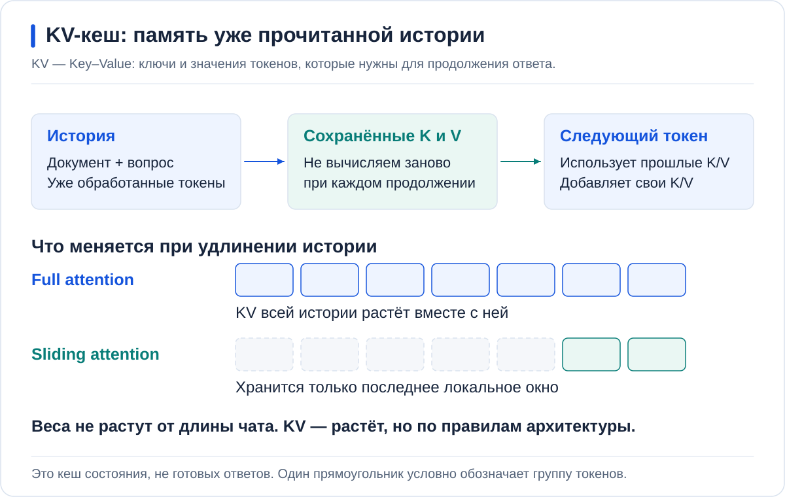
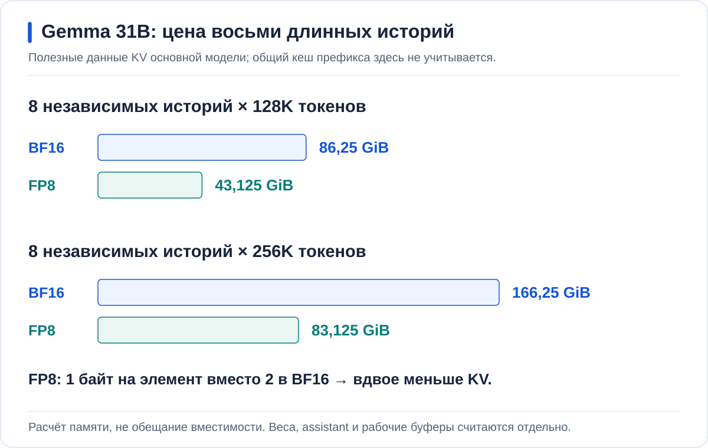
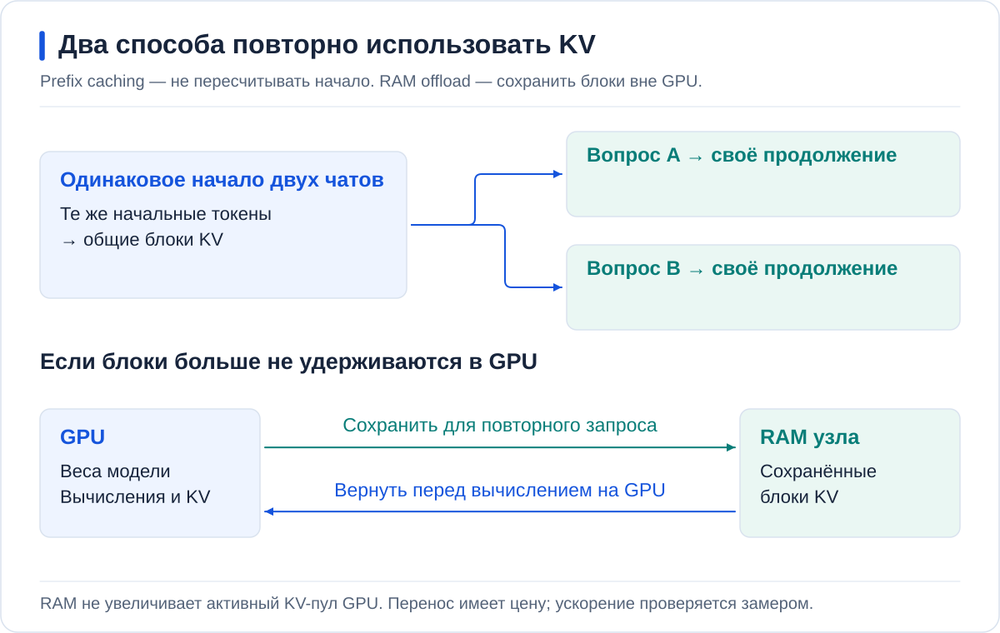
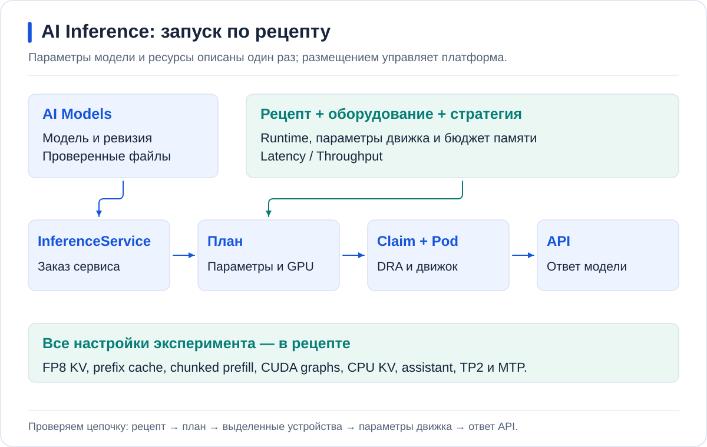
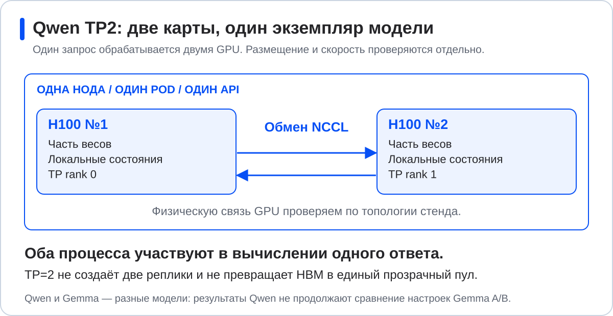

<p align="center">
  <a href="https://github.com/aleksandr-podmoskovniy/hardfest-gpu-workshop">
    
  </a>
</p>

# Инференс без простоя GPU: чиним LLM-сервис руками и делим карту на живом кластере

Александр Подмосковный, Флант / Deckhouse Platform

Стенд: **две H100 для Gemma 4 31B и Qwen; A30 для небольших моделей**.

<a id="ab"></a>
## 1. Базовая модель под нагрузкой

### Почему работающий чат начинает ждать?

**Gemma A — Base уже запущена** и отвечает в [Open WebUI](https://ai.ap4y.ru).
После регистрации и одобрения аккаунта доступ выдаётся автоматически.
Первый запрос проверяет законченный ответ; серия запросов — поведение под нагрузкой.

Обработка запроса моделью называется **инференсом**.
Текст поступает в виде **токенов** — частей слов и знаков;
из них модель строит продолжение.

<a id="chat"></a>
Под нагрузкой ответ может начаться позже, а в метриках появится очередь.
У Base окно **16K**; цель настройки — **128K у Gemma Tune**, затем **256K у Qwen**.

<a id="monitoring"></a>
### Где возникает ограничение?

В дашборде **AI Inference / Service performance** выбираются
`hardfest-demo`, Service `hf-gemma-a` и интервал серии.

| Что сравнивать | На какой вопрос отвечает |
| --- | --- |
| Running / Waiting | Сколько запросов выполняется, сколько ждёт? |
| Использованная память GPU | Помещается ли состояние запросов? |
| GPU utilization | Какую долю времени GPU выполняет операции? |

Очередь — симптом; занятая память не означает занятые вычисления.
Разберём **память**, **вычисления** и **размещение**, меняя настройки
второго экземпляра — Gemma B — и сравнивая с A.

<details>
<summary>Профиль Base и контрольная серия</summary>

Контроль: **8 запросов по 8192 входных и 2048 выходных токенов, 4 одновременно**,
без фоновых запросов. Он сравнивает скорость, а не предельное окно.

Сервер — **vLLM 0.31**, развёрнутый через Helm. В [профиле A](values/gemma-a.yaml) выключены
prefix cache, KV-offload, chunked prefill, CUDA graphs и speculative decoding.
Окно 16K выбрано для контрольного профиля, а не измерено как предел H100.

Application `hardfest-gemma-a` применён при подготовке.
Команды выполняются из частного `k8s-config`; переменные —
в [подготовке](docs/SETUP.md). `SLOT` выбирает экземпляр, `SERIES` — результат.

```bash
export SLOT=a SERIES=a-base-1
# B1: export SLOT=b SERIES=b-cache-1
# B2: export SLOT=b SERIES=b-spec-1
export TOKENIZER_PATH=/data/modelcache/models/gemma-4-31b
mkdir -p "results/hardfest/$SERIES"
set -o pipefail
kubectl --context "$GPU_CONTEXT" -n hardfest-demo exec "deployment/hf-gemma-$SLOT" -- \
  vllm bench serve --backend vllm \
    --base-url "http://hf-gemma-$SLOT.hardfest-demo.svc.cluster.local:8000" \
    --endpoint /v1/completions --model gemma-4-31b --tokenizer "$TOKENIZER_PATH" \
    --dataset-name random --seed 42 \
    --random-input-len 8192 --random-output-len 2048 --random-range-ratio 0 \
    --num-prompts 8 --max-concurrency 4 --ignore-eos --temperature 0 \
    --ready-check-timeout-sec 0 --num-warmups 0 \
    --save-result --result-dir /dev --result-filename stdout \
  | tee "results/hardfest/$SERIES/bench.txt"
```

Критерии: `completed=8`, `failed=0`, `total_input_tokens=65536`,
`total_output_tokens=16384`. Первый проход и повтор сохраняются отдельно:
одинаковые запросы могут использовать прогретый кеш.

Этот клиент делит с сервером CPU узла.
Для итогового сравнения ручного и автоматического запуска используется
[отдельный CPU-клиент](#gemma-compare).

</details>

<a id="contents"></a>
<details>
<summary>Маршрут и другие варианты стенда</summary>

1. [Нагрузка на Base](#ab)
2. [Память и B Cache](#memory)
3. [Вычисления и B Tune](#speculation)
4. [Размещение и A30](#placement)
5. [Автоматизация](#platform)
6. [Когда нужны новые GPU](#conclusion)
7. [Учёт в шлюзе](#results)
8. [Qwen на двух GPU](#tp2)

[Вариант на двух RTX 5060 Ti](RTX5060.md), [подготовка](#setup),
[завершение работы](#cleanup).

</details>

---

<a id="memory"></a>
## 2. Память: веса и KV-кеш

### Что занимает карту, кроме весов?

Память GPU занимают веса — общие для запросов параметры модели,
рабочие буферы и **KV cache (Key–Value cache)** —
ключи и значения прошлых токенов.

KV позволяет продолжать историю без её пересчёта на каждом шаге.
Это **не кеш ответов**: растёт история — растёт состояние.



### Сколько памяти потребуют 128K и 256K?

**Attention** связывает текущий токен с контекстом. Full attention хранит KV
всей истории; sliding-window attention — последних токенов. Поэтому цена
контекста зависит от архитектуры, а не только от числа параметров модели.

У Gemma 4 31B полную историю хранят 10 слоёв, последние 1024 токена — ещё 50.
**1024 здесь — локальное окно слоёв, не длина запроса.** Для одной истории:

```text
KV в BF16 ≈ 80 KiB × S + 0,78125 GiB, при S ≥ 1024
```

`S` — вход вместе с уже созданным ответом.
**BF16** занимает два байта на элемент; **FP8** — один.
FP8 вдвое уменьшает полезный KV,
не меняя веса.

| Контекст | 1 история, BF16 | N=8, BF16 | N=8, FP8 |
| --- | ---: | ---: | ---: |
| **128K = 131 072** | 10,78125 GiB | **86,25 GiB** | **43,125 GiB** |
| **256K = 262 144** | 20,78125 GiB | **166,25 GiB** | **83,125 GiB** |



Здесь `N=8` — восемь **независимых** историй без весов и буферов.
Общие блоки префикса не умножаются на восемь. Памяти для восьми полных окон
может не хватить — нужен меньший KV и повторное использование.

<details>
<summary>Полный расчёт Gemma 31B: архитектура, формула и awk</summary>

В **GQA (Grouped-Query Attention)** несколько attention-голов используют
общие K/V. Для памяти важны KV-головы `Hkv`, их размерность `D`,
число слоёв, история `S` и байты элемента `b`.
Множитель 2 учитывает ключи и значения.
Для `N` независимых историй одинаковой длины результат умножается на `N`.

[Закреплённый config.json](https://huggingface.co/google/gemma-4-31B-it/blob/842da3794eaa0b77d5f08bae87a17459d91ff475/config.json):

| Attention | Слоёв | Hkv | D | Сохранённых токенов |
| --- | ---: | ---: | ---: | --- |
| Full | 10 | 4 | 512 | `S` |
| Sliding | 50 | 16 | 256 | `min(S, 1024)` |

```text
KV(S) = 2 × b × [10 × 4 × 512 × S + 50 × 16 × 256 × min(S, 1024)] байт
```

Для BF16: полная часть — `2 × 2 × 10 × 4 × 512 = 80 KiB` на токен;
локальная — `2 × 2 × 50 × 16 × 256 × 1024 = 0,78125 GiB`.
При 128K → 256K удваивается только полная часть.

```bash
awk -v S=131072 -v N=8 -v b=2 'BEGIN {
  W = S < 1024 ? S : 1024
  full = 2*b*10*4*512*S / 1073741824
  local = 2*b*50*16*256*W / 1073741824
  printf "Full %.5f + sliding %.5f = %.5f GiB/history; %d histories = %.5f GiB\n", full, local, full+local, N, N*(full+local)
}'
```

Для 256K — `S=262144`, для FP8 — `b=1`.
[Формат хранения в vLLM 0.31](https://github.com/vllm-project/vllm/blob/v0.31.0/vllm/model_executor/models/gemma4.py).

Доступный пул: `Kpool ≈ G × u − W − R`, где `G` — память GPU,
`u` — доля движка, `W` — веса, `R` — буферы и резервы.
Размер зарезервированного пула берётся из логов, занятость блоков — из метрик;
одного `nvidia-smi` недостаточно. [Проверка пула](docs/MEMORY_BUDGET.md#verify-kv).

</details>

<a id="ram"></a>
### Как переиспользовать один документ?

**Prefix caching** переиспользует KV одинакового начала запросов:
вопрос в конце сохраняет префикс, изменение начала — сокращает.
**KV RAM offload** сохраняет вытесненные блоки в RAM
и возвращает на GPU для вычислений.



**B Cache** сохраняет 16K, добавляя prefix cache, FP8 KV и **32 GiB RAM**.
Маршрут **Gemma B — Tune** пока ведёт на эту первую конфигурацию B.

**На узле со 128 GiB сначала A останавливается через Git/Argo**,
после отключения маршрута и завершения запросов. Совместный запуск требует
достаточного [бюджета RAM](docs/MEMORY_BUDGET.md#ram-выбрать-порядок-запуска).

<details>
<summary>Применение B Cache: профиль → Git → Argo CD</summary>

В рабочем `$DEMO_DIR/values/gemma-b.yaml` задаётся `replicaCount: 1`.
Используется целый профиль, поверх него — только привязки площадки.
Triton attention работает с CPU KV-пулом:

```yaml
kv-transfer-config:
  kv_connector: OffloadingConnector
  kv_role: kv_both
  kv_connector_extra_config:
    cpu_bytes_to_use: 34359738368
```

Проверка рендера и API-схемы:

```bash
set -o pipefail
helm template hf-gemma-b "$DEMO_DIR/charts/vllm-runtime" -n hardfest-demo \
  -f "$DEMO_DIR/values/gemma-b.yaml" -f "$DEMO_DIR/site/gemma.yaml" |
  kubectl --context "$GPU_CONTEXT" apply --dry-run=server -f -
```

После успешной проверки:

```bash
git add -- "$DEMO_DIR/values/gemma-b.yaml"
git diff --cached --check
git diff --cached
git commit -S -s -m "Start Gemma with prefix cache and RAM KV"
git push
git rev-parse HEAD
```

У `hardfest-gemma-b` проверяется diff и выполняется Sync этого коммита
**без общего Prune**. Маршрут **Gemma B — Tune** включается после готовности
и ответа модели. Следующие изменения проходят тот же путь;
[подробности GitOps](docs/GITOPS.md).

</details>

### Как отличить работу кеша от выделенной памяти?

Проверка: одинаковый документ **в сообщении**, повтор, затем изменённое начало.
Вложения и база знаний здесь не подходят: поиск меняет префикс.

| Что сравнивать | Что проверяется |
| --- | --- |
| Prefix-cache hit rate и TTFT | Переиспользование начала и время до первого токена |
| GPU→CPU | Сохранение блоков в RAM |
| CPU→GPU и external-prefix hits | Возврат вытесненного префикса |

**TTFT** — время до первого токена.
Выделенные 32 GiB не доказывают переносов: для offload нужен
[опыт вытеснения и повтора](docs/MEASUREMENTS.md#offload-replay).
[Prefix caching](https://docs.vllm.ai/en/v0.31.0/features/automatic_prefix_caching/),
[KV-offload](https://docs.vllm.ai/en/v0.31.0/features/kv_offloading_usage/).

---

<a id="speculation"></a>
## 3. Вычисления: prefill и decode

<a id="latency"></a>
### Почему кеш не решает всю задержку?

Незнакомый текст всё равно нужно обработать, а ответ — создать.
**Prefill** обрабатывает вход и строит KV; **decode** последовательно генерирует токены.

```text
Время ответа ≈ очередь + prefill + decode + прочие задержки
```


**ITL** — интервал между токенами;
**TPOT** — среднее время токена после первого.
Reasoning, рассуждения модели, тоже входит в decode: до финального текста
модель может генерировать их.

### Как длинному входу не задерживать соседей?

**Chunked prefill** разбивает вход на порции, между которыми продолжается decode.
Меньшая порция чаще уступает место соседям, но требует больше шагов.


Смешанная серия снимается **на Cache до его остановки**, затем повторяется на Tune.
Она покажет, меняется ли ожидание короткого запроса рядом с длинным.

### Как ускорить продолжение?

При **speculative decoding** небольшой draft предлагает токены,
основная target-модель проверяет их. Непринятое продолжение отбрасывается.


Gemma использует совместимый assistant с **MTP (Multi-Token Prediction)**,
не произвольную маленькую модель. Выигрыш зависит от acceptance —
доли принятых предложений — и стоимости проверки.
[Устройство Gemma assistant](https://docs.vllm.ai/en/v0.31.0/features/speculative_decoding/mtp/).

### Что добавляет Tune?

[Tune](values/gemma-b-spec.yaml) добавляет chunked prefill, assistant
и **CUDA graphs** — переиспользуемые последовательности GPU-операций.
Окно — **128K**, бюджет prefill **2048** ограничивает шаг, не вход.

**Перед заменой маршрут B отключается, запросы завершаются, Cache останавливается.**
Две B одновременно не запускаются; настройки A сохраняются.

<details>
<summary>Переключение Cache → Tune и смешанная серия</summary>

На Cache: вход **8192 токена**, через **50 мс** — вход **128 токенов**;
выход у обоих — 512. [Клиент с фиксированным расписанием](docs/MEASUREMENTS.md#mixed-prefill)
сохраняет фактические времена. Без перекрытия запросов конкуренция не проверена.

1. В рабочем `gemma-b.yaml`: `replicaCount: 0`, commit/push и Sync.
   Продолжение — после остановки Pod.
2. Замена профиля целиком:

```bash
cp "$DEMO_DIR/values/gemma-b-spec.yaml" "$DEMO_DIR/values/gemma-b.yaml"
```

3. `replicaCount: 1`; второй `valueFiles` Application B —
   `../../site/gemma-assistant.yaml`. Он подключает модель и assistant из ai-models.
4. Render с этим site-файлом, commit/push обоих изменённых файлов, Sync.
   При App-of-Apps сначала обновляется родитель.
5. После загрузки обеих моделей и ответа возвращается маршрут **Gemma B — Tune**.

На Tune повторяются та же смешанная серия и контрольная нагрузка A/B.
`max-num-batched-tokens: 2048` задаёт бюджет одного шага prefill;
`max-model-len: 131072` — окно всего запроса.

</details>

| Что сравнивать | Зачем |
| --- | --- |
| TTFT короткого запроса | Проверить соседство с длинным prefill |
| ITL, выходные токены/с | Проверить скорость продолжения |
| Ошибки и фактические длины | Исключить «ускорение» за счёт неполного ответа |

Это сравнение **набора настроек**, включая окно, не измерение вклада одного MTP.

Для нескольких исполнителей существуют
[cache-aware routing](https://docs.dynamo.nvidia.com/dynamo/knowledge-base/concepts/system-architecture/kv-aware-routing) —
выбор по сохранённому префиксу, и
[prefill/decode disaggregation](https://docs.vllm.ai/en/v0.31.0/features/disagg_prefill/) —
разделение фаз. Они не включены в стенд.

<a id="long-context"></a>
### А длинный документ и длинный ответ помещаются?

Tune уже настроен на 128K. Длинный вход и законченный ответ проверяются отдельно
от короткой A/B-серии. **Окно включает вход и ответ**, системный текст и reasoning;
лимит ответа WebUI — **8192**.

Теперь в чат поступает **целый длинный документ**, а не найденные фрагменты.
В середине документа есть контрольный факт; вопрос просит его найти.
Правильный ответ и фактическая длина входа в журнале показывают,
что модель обработала длинную историю, а не только приняла настройку 128K.

<details>
<summary>Три длинные серии: точные длины и критерии</summary>

| Проверка | Вход | Выход | Запросов / одновременно |
| --- | ---: | ---: | ---: |
| Длинный документ | 57 344 | 512 | 1 / 1 |
| Почти полное окно | 122 880 | 512 | 1 / 1 |
| Длинный ответ | 122 880 | 8192 | 1 / 1 |

Восемь клиентов не означают восемь полных окон: активный KV должен помещаться в GPU.
В профиле `max-model-len: 131072`. В команде раздела 1 выбирается B,
длины заменяются по таблице, обязательно
`--num-prompts 1 --max-concurrency 1` и отдельное имя каждой серии.
Критерии: `completed=1`, `failed=0`, заданные длины, отсутствие ошибок памяти.

Последняя серия проверяет 8192 выходных токена через completions API.
Для чата нужен дополнительный запас на шаблон.
256K в расчёте Gemma — оценка памяти, **не результат этого запуска**:
Tune здесь использует 128K, финальный Qwen — 256K.

</details>

---

<a id="placement"></a>
## 4. Размещение моделей на GPU

### Нужна ли маленькой модели целая карта?

Отдельная GPU для каждой маленькой модели может простаивать.
Следующий шаг — совместное размещение.

**Device plugin** публикует целочисленный ресурс `nvidia.com/gpu: 1`;
разделение требует дополнительных настроек.
**DRA (Dynamic Resource Allocation)** добавляет выбор по атрибутам,
заявку ResourceClaim и конфигурацию устройства.

Режимы зависят от драйвера и оборудования, не одного DRA.
[Авторский разбор](https://habr.com/ru/companies/flant/articles/1020276/).

### Как три сервиса делят A30?

**MIG (Multi-Instance GPU)** аппаратно разделяет память и вычисления.
**MPS (Multi-Process Service)** позволяет нескольким процессам работать внутри
выделенной части; он не добавляет память и не заменяет изоляцию MIG.

| Подготовленный сервис | Назначение | Размещение |
| --- | --- | --- |
| Qwen3 Embedding 4B W4A16 | Векторы текста | Первая `2g.12gb` |
| Qwen3 Reranker 4B W4A16 | Оценка найденных фрагментов | Та же часть через MPS |
| Whisper large-v3 | Речь в текст | Вторая `2g.12gb` |

W4A16 — 4-битные веса и 16-битные активации. Проверяется **готовое размещение**
A30, без переразметки; Gemma на H100 продолжает работать.


<details>
<summary>Проверка A30: MIG ID, заявки и MPS-процессы</summary>

[Device plugins](https://kubernetes.io/docs/concepts/extend-kubernetes/compute-storage-net/device-plugins/) и
[DRA](https://kubernetes.io/docs/concepts/resource-management/dynamic-resource-allocation/).

Команды выполняются **на ноде кластера A30**:

```bash
nvidia-smi -L
nvidia-smi mig -lgi
nvidia-smi mig -lci
```

Эмбеддер и реранкер должны иметь один MIG ID, Whisper — другой.
[Проверка Pod → ResourceClaim → MIG и MPS](docs/TROUBLESHOOTING.md#a30-claims).
Совместная нагрузка сравнивается с отдельной по задержкам, ошибкам и памяти.
Метрика MIG не разделяет вклад MPS-процессов.

Для проверки поиска подходит документ: «В проекте “Липа” обслуживание начинается
во вторник в 16:40». После индексации база подключается к чату;
один вопрос проверяется с базой и без неё.

[Создание этих заказов](#a30-orders) разобрано после устройства автоматизации.

</details>

### Что получает пользователь?

**RAG (Retrieval-Augmented Generation)** добавляет найденные фрагменты к запросу:
эмбеддер строит векторы, индекс ищет, реранкер уточняет выбор, Gemma отвечает.
Для голосового ввода Whisper преобразует речь в текст — не синтезирует её.

У документа с известным фактом проверяются ответ, ссылка на источник
и обращения к обоим сервисам. У голосового запроса — транскрипция Whisper.
Для этих моделей важны задержки и ошибки, не чат-токены.

---

<a id="platform"></a>
## 5. Автоматический запуск через AI Inference

### Можно ли не собирать эти настройки каждый раз?

Ручной путь связал модель, память, вычисления и размещение.
**AI Inference** автоматизирует этот подбор.
**InferenceService** — заказ с моделью и требованиями; планировщик сопоставляет
их с оборудованием и **рецептами** — совместимыми конфигурациями runtime.



В каталоге **ai-models**: скачанная модель → **«Запустить инференс»** →
стратегия и ресурсы → план → сервис.
В GitOps этот же заказ хранится в Git и применяется Argo CD.

### Повторяет ли автоматический запуск ручную Tune?

Для сравнения **до остановки A проверяется рецепт**: те же веса, 128K,
FP8 KV, RAM-offload, assistant и параметры выполнения.

Два настроенных экземпляра требуют не менее **192 GiB RAM** с проверенным
распределением. На **128 GiB** результат B сохраняется до её остановки;
запуски последовательные.

После отключения маршрута и завершения запросов A останавливается через Git/Argo.
Новый запуск — после освобождения её GPU-заявки.
В чате платформенный вариант называется **Gemma A — DP**.

<details>
<summary>Заказ Gemma, проверка API и подключение чата</summary>

У ручной A: `replicaCount: 0`, commit/push и Sync; продолжение после исчезновения Pod.
В `$DEMO_DIR/platform/gemma.yaml`: `order.enabled: true`.
[Проверка рецепта и поставки](docs/SETUP.md#inference-readiness).

```bash
set -o pipefail
helm template hf-platform-gemma "$DEMO_DIR/charts/inference-service" \
  -n hardfest-demo -f "$DEMO_DIR/platform/gemma.yaml" |
  kubectl --context "$GPU_CONTEXT" apply --dry-run=server -f -
```

Commit/push и Sync `hardfest-gemma-platform`; сервис — `hf-platform-gemma`.
После Ready проверяется ответ API, затем чат. В отдельном терминале:

```bash
kubectl --context "$GPU_CONTEXT" -n hardfest-demo get service hf-platform-gemma
kubectl --context "$GPU_CONTEXT" -n hardfest-demo port-forward svc/hf-platform-gemma 18005:80
```

Порт 80 заменяется фактическим, если Service публикует другой.
Ключ вводится из менеджера секретов в основном терминале:

```bash
set +x
IFS= read -r -s MODEL_API_KEY
curl --fail --max-time 30 \
  --header @<(printf 'Authorization: Bearer %s\n' "$MODEL_API_KEY") \
  http://127.0.0.1:18005/v1/models
```

В `model` подставляется ID из `/v1/models`:

```bash
curl --fail-with-body --max-time 180 \
  --header @<(printf 'Authorization: Bearer %s\n' "$MODEL_API_KEY") \
  -H 'Content-Type: application/json' http://127.0.0.1:18005/v1/chat/completions \
  -d '{"model":"REPLACE_SERVED_MODEL_ID","max_tokens":512,"temperature":0,"messages":[{"role":"user","content":"Зачем нужен KV-кеш?"}]}'
unset MODEL_API_KEY
```

Нужен законченный ответ без ошибки, затем port-forward закрывается.
Ключ не сохраняется в Git и не попадает в аргументы curl.
Для Qwen используются его Service, порт, ID и ключ.

</details>

<a id="gemma-compare"></a>
[Один CPU-клиент](docs/MEASUREMENTS.md#gemma-client-h100) сравнивает B и платформу:
те же запросы и tokenizer, TTFT, ITL, токены/с и ошибки.
На 128 GiB режим `manual` выполняется **до остановки B**, `platform` — после замены.

<a id="a30-orders"></a>
<details>
<summary>Тем же способом: заказы трёх сервисов A30</summary>

Подготовленные сервисы A30 также созданы через InferenceService.
Модели описаны в `catalog/a30.yaml`.

**Нужны свободные ресурсы, поддержка драйвера и заранее включённый MIG mode.
Чужие партиции не переразмечаются.**

| Values | Application |
| --- | --- |
| `platform/embedding.yaml` | `hardfest-embedding-platform` |
| `platform/reranker.yaml` | `hardfest-reranker-platform` |
| `platform/whisper.yaml` | `hardfest-whisper-platform` |

В заказах `order.enabled: true`; далее render, commit/push и Sync.
Destination — кластер A30. Проверяются три готовых сервиса и их ответы.
`nvidia-smi` фиксирует одну ноду до и после: если части существовали раньше,
наблюдается выделение, не новая нарезка.

</details>

---

<a id="conclusion"></a>
## 6. Когда нужны новые GPU?

Повторный контекст требует кеширования, медленная генерация — настройки вычислений,
маленькие сервисы — совместного размещения.

**Сначала используются возможности имеющихся карт.** Расширение обосновано,
когда после настройки измеренная нагрузка не укладывается в нужные задержки,
контекст или пропускную способность. [Методика сравнения](docs/MEASUREMENTS.md).

---

<a id="results"></a>
## 7. Шлюз: кто отправил запрос и сколько использовал?

Пользователи уже отправляют запросы. Теперь разберёмся, чей запрос
занял ресурсы и сколько токенов он потребил.
**ai-mcp-gateway** на базе Bifrost связывает пользователя, маршрут и модель.
После одобрения аккаунта личный **VK (Virtual Key)** получает доступы и лимиты.
Ключ шлюза к runtime его не заменяет.

Два аккаунта должны оставить в журнале разные VK, правильных владельцев
и фактические токены. Смена модели сохраняет доступы и накопленный расход.

**Стоимость условная, списаний нет.** Учитываются фактические токены,
не настроенное окно.
[Доступы, тарифы и ограничения учёта](docs/CHAT_AND_ACCESS.md).

<a id="topology"></a>
Чат → шлюз → выбранный сервис. Argo доставляет конфигурацию,
но не сообщения. [Схема стенда](assets/01-topology.svg).

---

<a id="tp2"></a>
## 8. Большая модель на двух GPU

### Что делать, если одной карты недостаточно?

Последняя задача обратна разделению A30: **nvidia/Qwen3.8-Flash-Next-NVFP4**
использует обе H100. **TP (Tensor Parallelism)** делит тензорные вычисления
между картами. Работает одна модель, а не две независимые копии;
сервер остаётся vLLM.



[Qwen](values/qwen-tp2.yaml) использует окно **256K**.
Рецепт должен воспроизвести закреплённые параметры запуска.

**До остановки Gemma проверяются веса, runtime, рецепт и класс устройств Qwen.**
Затем отключаются маршруты Gemma, завершаются запросы и освобождаются обе H100.
Для удаления платформенной Gemma нужен **адресный Prune только её заказа**
после просмотра diff. Model, PVC и чужие нагрузки сохраняются; A30 и чат работают дальше.

<details>
<summary>Освобождение H100 и автоматический запуск Qwen</summary>

Профиль задаёт `max-model-len: 262144`, `max-num-seqs: 16` и **16 GiB RAM для KV**.

Ручная B: `replicaCount: 0`; платформенная Gemma: `order.enabled: false`.
После Git/Argo и адресного Prune обе карты должны быть свободны.
В `$DEMO_DIR/platform/qwen.yaml` включается `order.enabled: true`:

```bash
set -o pipefail
helm template hf-qwen-platform "$DEMO_DIR/charts/inference-service" \
  -n hardfest-demo -f "$DEMO_DIR/platform/qwen.yaml" |
  kubectl --context "$GPU_CONTEXT" apply --dry-run=server -f -
```

Commit/push и Sync `hardfest-qwen-platform`.
В плане — `acceleratorCount=2`, в ResourceClaim — две разные GPU одной ноды,
в Pod — `tensor-parallel-size: 2`.
После проверки API по разделу 5 включается **Qwen — TP2** для действующих VK,
без сброса расхода.

У Qwen встроенный MTP, отдельная Gemma assistant не нужна.
Native KV-offload использует Simple CPU backend, не Gemma OffloadingConnector.
Для смены модели удалять PVC не нужно.

</details>

### Две карты обслуживают длинные запросы и восемь клиентов?

Проверяются ответ в чате, обе карты и очередь.
Восемь параллельных запросов и один длинный — разные проверки:
восемь клиентов не означают восемь полных окон.

<details>
<summary>Нагрузка Qwen: параллельность и длинный вход</summary>

[CPU-клиент Qwen](examples/qwen-benchmark-job.yaml):

| Серия | Вход / выход | Одновременно |
| --- | --- | ---: |
| Контрольная | 8192 / 512 | Сначала 1, затем 4 и 8 |
| Длинная | 122 880 / до 8192 | 1 |

Длинная серия укладывается в 128K, **не заполняя всё окно 256K**.
Проверяются Running/Waiting, занятый KV, фактические длины и законченные ответы.
Наличие NVLink — межкарточного соединения — не доказывает скорость обмена.

При [подготовке](docs/SETUP.md) выбираются CPU-нода, Service, авторизация и длины.
До проверки параметров Job остаётся `suspend: true`.

</details>

---

<a id="cleanup"></a>
### Завершение работы

Маршруты отключаются, запросы завершаются. Ручным профилям задаётся
`replicaCount: 0`, заказам — `order.enabled: false`; далее Git/Argo.
Удаление заказа — только адресным Prune по проверенному diff.

**Namespace, Model, PVC, GPUClass/GPUPool, чаты и базы знаний сохраняются.**
Остановка подтверждается отсутствием Pod нагрузки и освобождением заявок.
[Процедура](docs/GITOPS.md#остановка).

<a id="setup"></a>
<details>
<summary>Подготовка и справка</summary>

До начала A и три сервиса A30 отвечают; B и заказы Gemma/Qwen подготовлены,
но выключены. Веса, маршруты, личный доступ и мониторинг проверены заранее.

- [Узлы, переменные и запуск A](docs/SETUP.md)
- [GitOps](docs/GITOPS.md), [ai-models](catalog/README.md), [мониторинг](docs/OBSERVABILITY.md)
- [Бюджет памяти](docs/MEMORY_BUDGET.md), [диагностика](docs/TROUBLESHOOTING.md), [источники](docs/SOURCES.md)

Публичные профили по умолчанию выключены. NodeCache хранит веса;
контейнерный образ vLLM имеет отдельный кеш.

</details>
