<p align="center">
  <a href="https://github.com/aleksandr-podmoskovniy/hardfest-gpu-workshop">
    
  </a>
</p>

# Инференс без простоя GPU — две RTX 5060 Ti

Александр Подмосковный, Флант / Deckhouse Platform

[Основной стенд: две H100](README.md) | Этот стенд: две RTX 5060 Ti по 16 GiB

На двух картах по 16 GiB разберём три задачи: ускорить повторный запрос,
обработать длинный документ и запустить модель, которой тесно на одной GPU.
Начнём с Gemma E2B, посчитаем её KV-кеш и поэтапно включим оптимизации.
Затем расширим контекст до 64K и 128K, перенесём запуск в AI Inference
и повторим проверку длинного входа на Qwen3.5-9B с TP2 и MTP.
Это самостоятельная программа: параметры и расчёты ниже относятся к RTX,
а не к уменьшенной копии H100.

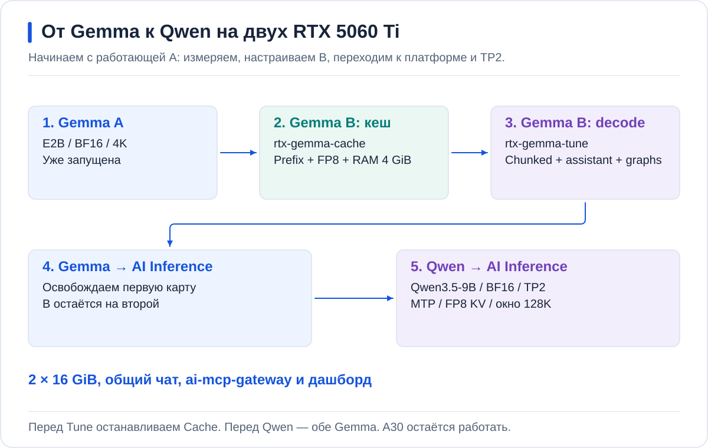

Модели подготавливаются через **ai-models**. Платформенные Gemma и Qwen запускаются
через **InferenceService**, со ссылкой на `Model` из каталога. Ручная A/B-пара нужна
для разбора настроек; её Deployment тоже получает веса из ai-models.
Helm values и заказы хранятся в Git, выбранный commit применяет Argo CD.

<a id="contents"></a>
## Содержание

- [Стенд и чат](#topology), [подготовка моделей](#setup), [дашборд](#monitoring)
- [1. Где теряется время](#latency)
- [2. Что помещается в 16 GiB](#memory)
- [3. Gemma A: исходная точка](#ab)
- [4. Первая итерация: prefix cache и KV в RAM](#ram)
- [5. Вторая итерация: chunked prefill и speculative decoding](#speculation), [контекст 64K → 128K](#long-context)
- [6. Gemma через AI Inference](#platform)
- [7. Базы знаний и голос: три сервиса на A30](#placement)
- [8. Qwen через AI Inference: TP2 и MTP](#tp2)
- [Остановка](#cleanup), [что проверено](#results)

<a id="topology"></a>
## Стенд и чат

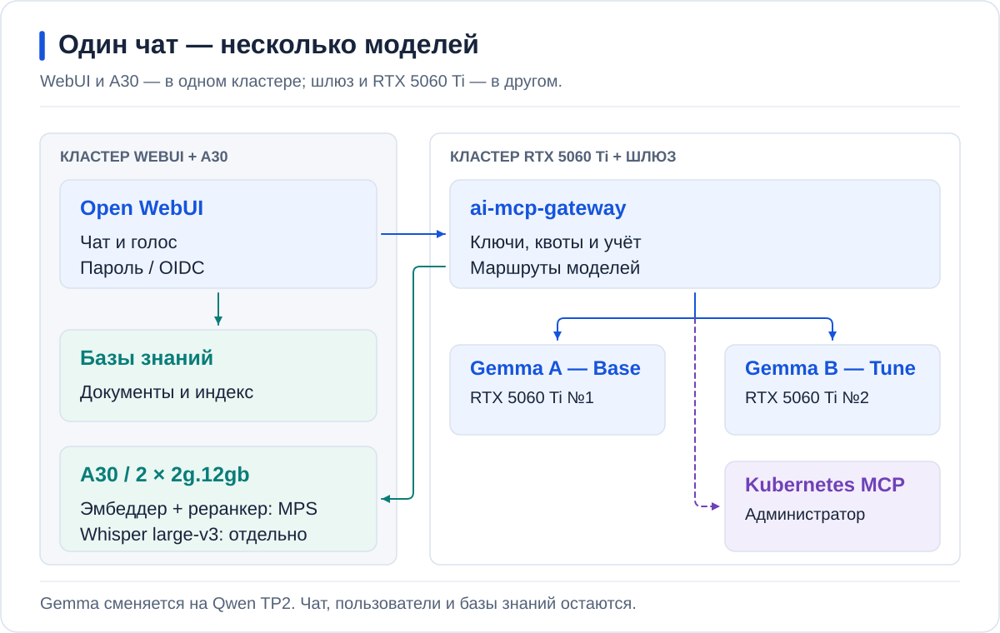

| Компонент | Назначение |
| --- | --- |
| Две RTX 5060 Ti по 16 GiB на одной ноде | Две отдельные Gemma; в финале один Qwen с TP2 |
| ai-mcp-gateway | Маршруты моделей, личные Virtual Key, лимиты и учёт |
| Open WebUI | Один вход, история чатов, базы знаний и голос |
| A30 в соседнем кластере | Эмбеддер, реранкер и Whisper через AI Inference |
| Argo CD | Применение Helm values и заказов из частной репы k8s-config |

В WebUI сначала доступны `Gemma A — Base` и `Gemma B — Tune`.
При переходе к платформе первая меняется на `Gemma A — DP`, затем обе уступают
место `Qwen 9B — TP2`. `DP` — подпись платформенного запуска, не Data Parallel.
Не включайте fallback между A/B и кеш готовых ответов шлюза: они скроют различие профилей.

Участник регистрируется с паролем и ждёт одобрения. Затем получает один личный VK,
доступ к моделям, базам знаний и голосу, но не к Kubernetes MCP.
Администратор входит по OIDC; доступ MCP к кластеру проверяется отдельно.
Имена моделей меняются, пользователь и его накопленный расход — нет.

Настройка маршрутов и проверка прав: [чат](labs/rtx5060.md#chat),
[выдача и отзыв VK](docs/CHAT_AND_ACCESS.md).

<a id="setup"></a>
## Подготовка моделей и GitOps

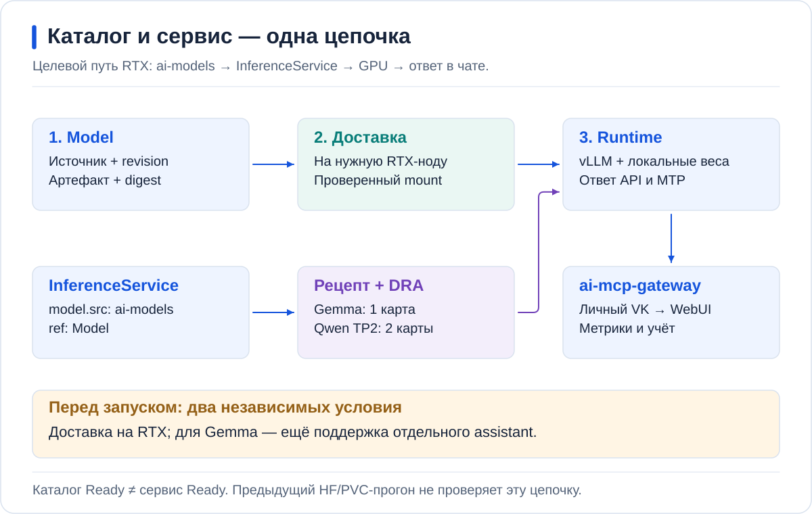

В namespace `hardfest-rtx` импортируются три закреплённых артефакта:

| Объект Model | Репозиторий | Потребитель |
| --- | --- | --- |
| `rtx-gemma-e2b` | `google/gemma-4-E2B-it` | Все варианты Gemma |
| `rtx-gemma-e2b-assistant` | `google/gemma-4-E2B-it-assistant` | Speculative decoding Gemma |
| `rtx-qwen35-9b` | `Qwen/Qwen3.5-9B` | Финальный сервис TP2 |

Assistant — отдельные совместимые веса, а не любая маленькая модель.
У Qwen MTP входит в основной checkpoint; четвёртый `Model` для него не нужен.

В [каталоге RTX](catalog/rtx.yaml) закреплены ревизии. Чарт `model-catalog`
создаёт `Model`; чарт `inference-service` — заказ со ссылкой на него.
Контроллер создаёт workload и GPU-заявку по рецепту. Не редактируйте дочерний
StatefulSet, чтобы подменить решение контроллера.

Перед выделением GPU проверьте три разных состояния:

1. **Каталог:** `Model Ready`, ненулевой размер и digest; записи видны в консоли.
2. **Доставка:** артефакт доступен на RTX-ноде, а не только в бакете или на H100.
3. **Запуск:** `InferenceService Ready`, ответ API и работа нужных механизмов.

`Pulling image` относится к образу runtime, а не к весам. Ни заполненный PVC,
ни работающий прямой HF-запуск сами по себе не создают запись в каталоге ai-models.

Все workload-профили в GitHub выключены. Заполняйте привязки площадки в частной
репе, проверяйте Helm render и server dry-run, затем commit/push и адресный sync.
Секреты создаются отдельно, их значения не попадают в Git.

[Подготовить каталог и доставку](labs/rtx5060.md#setup) | [Порядок GitOps](docs/GITOPS.md)

Для следующих команд рабочая директория — частный `k8s-config` с перенесёнными
чартами и файлами RTX. Значения контекстов и пути замените своими:

```bash
export GPU_CONTEXT=gpu-cluster
export ARGO_CONTEXT=management
export ARGO_NAMESPACE=argocd
export NS=hardfest-rtx
export RTX_DIR=argo-projects/gpu-cluster/hardfest-rtx
kubectl --context "$GPU_CONTEXT" -n "$NS" get models.ai.deckhouse.io
kubectl --context "$GPU_CONTEXT" -n "$NS" get modeldeliveries
```

**Перед каждым переходом** выберите Application текущего этапа и отправьте
только его изменения. Сначала render и dry-run, затем доставка именно этого commit:

```bash
git diff --check
git diff -- "$RTX_DIR"
git add -- "$RTX_DIR"
git diff --cached
git commit -S -s -m "Update RTX inference stage"
git push
export APP=rtx-gemma-base
export REVISION=$(git rev-parse HEAD)
kubectl --context "$ARGO_CONTEXT" -n "$ARGO_NAMESPACE" patch application "$APP" \
  --type merge -p "{\"operation\":{\"sync\":{\"revision\":\"$REVISION\",\"prune\":false,\"syncStrategy\":{\"apply\":{}}}}}"
```

`APP` для B — `rtx-gemma-tune`, для платформенных запусков —
`rtx-gemma-platform` и `rtx-qwen35-tp2`. Чужие изменения не включайте в commit.
Если Applications управляет родительский App-of-Apps, изменения их `valueFiles`
сначала должны попасть в него.

<a id="monitoring"></a>
## Один дашборд для всех запусков

Используйте **AI Inference / Service performance**: кластер, namespace,
сервис и модель выбираются фильтрами. Начните с `hardfest-rtx`, затем сравните A/B
на одном интервале. После перехода к платформе измените сервис, не дашборд.

| Вопрос | График или счётчик |
| --- | --- |
| Почему ответа ещё нет? | Очередь и TTFT |
| Почему текст появляется медленно? | TPOT / ITL и выходные токены/с |
| Переиспользуется ли префикс? | Запросы и попадания prefix cache |
| KV действительно вернулся из RAM? | CPU→GPU bytes и external-prefix hits |
| Assistant приносит токены? | Предложенные и принятые draft-токены |
| Где кончаются ресурсы? | VRAM, GPU KV, RAM контейнера, ошибки и перезапуски |

Пустой график не означает нулевую нагрузку. Сначала проверьте scrape target,
временной интервал и выбранный сервис. Для RTX нет смысла ожидать NVLink-метрики.

[Установить дашборд и проверить метрики](docs/OBSERVABILITY.md)

<a id="latency"></a>
## 1. Где теряется время

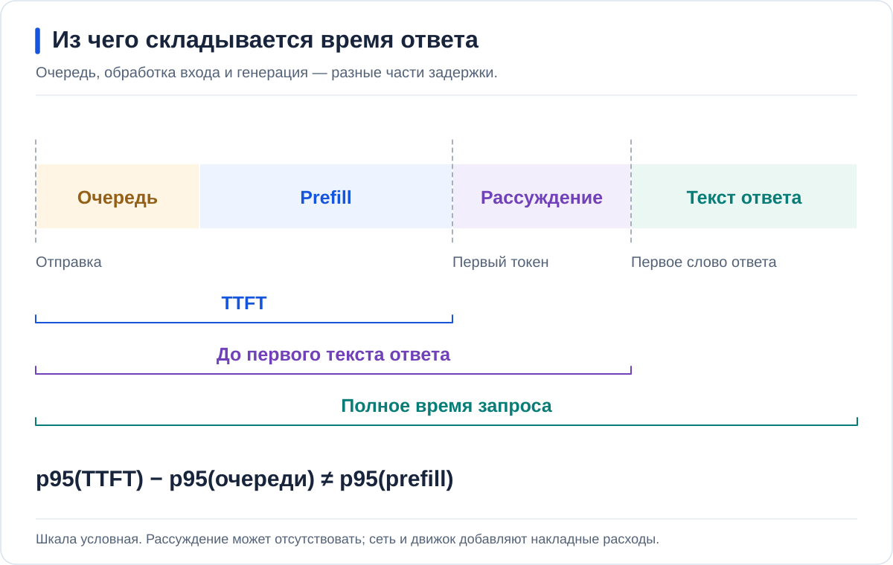

Prefill обрабатывает входную историю; decode добавляет токены ответа.
Длинный вход прежде всего влияет на время до первого токена, длинный выход —
на полную длительность. При нескольких пользователях появляется очередь.
По одному GPU utilization невозможно понять, какой этап ограничивает сервис.

Отправьте короткий запрос, затем запрос с длинным контекстом и коротким ответом.
Сопоставьте TTFT и TPOT. В дальнейших A/B-сериях длины входа, выхода,
параллельность и настройки reasoning должны совпадать.

<a id="memory"></a>
## 2. Что помещается в 16 GiB

### Считаем KV, а не угадываем по названию модели

Веса общие для запросов к одному экземпляру. KV — ключи и значения уже обработанных
токенов: новый query использует их при продолжении истории. Кеш позволяет не
вычислять прошлые K/V повторно; его размер зависит от истории, а не только от весов.

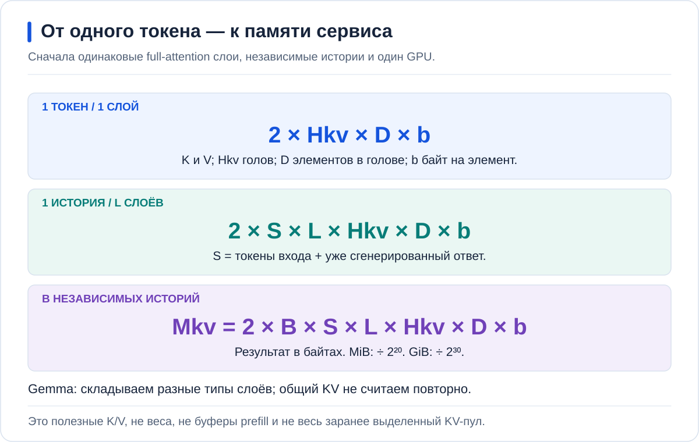

Один токен одного слоя: два вектора на KV-голову, каждый из `D` элементов по `b`
байт. Для одинаковых full-attention слоёв умножаем на `S` токенов, `L` слоёв и
`B` независимых историй. `S` включает вход и ответ; `Hkv` — число KV-голов,
**не число query-голов**. BF16 KV занимает 2 байта на элемент, FP8 — 1.
Это настройка кеша, не квантование весов.

В [config.json Gemma E2B](https://huggingface.co/google/gemma-4-E2B-it/blob/3e22461f65e89153144f8adb70e3b8c2cc9845a7/config.json)
смотрим `text_config`. Из 35 слоёв последние 20 переиспользуют KV более ранних:
`num_kv_shared_layers=20`. Собственные K/V создают **15 слоёв: 3 full и 12 sliding**.
Это межслойное разделение внутри модели, не prefix cache между запросами.
[Как vLLM выбирает источник общего KV](https://github.com/vllm-project/vllm/blob/v0.31.0/vllm/model_executor/models/gemma4.py#L473).

| Собственный KV | Слоёв | KV-голов | Размерность | Длина |
| --- | ---: | ---: | ---: | --- |
| Full attention | 3 | 1 | 512 | `S` |
| Sliding attention | 12 | 1 | 256 | `min(S, 512)` |

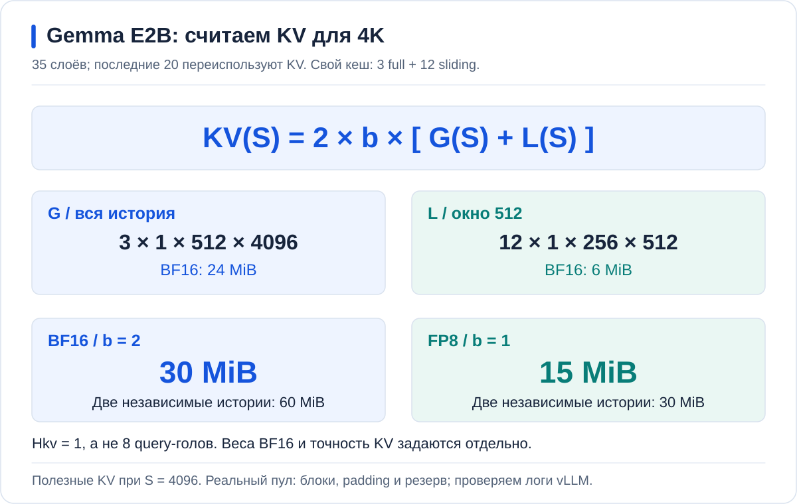

Для `S=4096`: full — `2 × 2 × 3 × 1 × 512 × 4096` = **24 MiB**;
sliding — `2 × 2 × 12 × 1 × 256 × 512` = **6 MiB**.
Итого **30 MiB** BF16 на историю; две независимые истории — **60 MiB**.
В FP8 получаем соответственно **15 и 30 MiB**.

```bash
awk -v S=4096 -v B=2 -v b=2 'BEGIN {
  W = S < 512 ? S : 512
  full = 2*b*3*1*512*S / 1048576
  local = 2*b*12*1*256*W / 1048576
  printf "Full %.0f + sliding %.0f = %.0f MiB/history; %d histories = %.0f MiB\n", full, local, full+local, B, B*(full+local)
}'
```

Поменяйте только `S` на 8192. Получится **54 MiB BF16**, не 60: full-слагаемое
выросло вдвое, sliding осталось 6 MiB. Это расчёт, **не смена окна A/B**.
Если умножить все 35 слоёв на всю историю или взять 8 query-голов вместо одной
KV-головы, получится неверная оценка.

### Почему процесс занимает гораздо больше

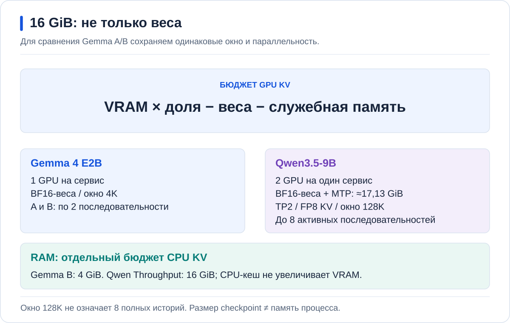

30 MiB — полезные KV одной истории, не вся память GPU и не размер выделенного
пула. vLLM резервирует пул блоков для запросов, учитывает их округление и размещение
разных типов attention. Отдельно нужны веса, активации, буферы prefill, CUDA graphs
и память assistant. Поэтому формула не обещает, что произвольное окно запустится.

После старта выпишите GPU KV capacity из логов. На дашборде сравните занятость
пула для одного и двух запросов; затем для повторённого и нового префикса.
Размер заранее выделенного пула при этом может не меняться, хотя доля занятых
блоков меняется. [Read-only команды и границы сравнения](docs/MEMORY_BUDGET.md#verify-kv).

| Параметр | Gemma A | Gemma B | Qwen TP2 |
| --- | --- | --- | --- |
| GPU | 1 | 1 | 2 |
| Точность весов | BF16 | BF16 | BF16 |
| Окно | 4096 для контроля | 4096 для A/B → 65 536 → 131 072 | 65 536 → 131 072 после обновления рецепта |
| Максимум последовательностей | 2 | 2 | 2 |
| CPU KV | Нет | 4 GiB | 4 GiB по рецепту |

E2B в названии Gemma не означает файл ровно из двух миллиардов параметров:
полный BF16 checkpoint занимает около 9,54 GiB. Языковые веса Qwen вместе с MTP —
примерно 17,13 GiB, больше доступных 15,93 GiB одной RTX. Поэтому финальный опыт
использует TP2 без квантования весов и без их выгрузки в RAM.

4K — контрольная точка сравнения, не конечная цель. Длинный контекст проверяем
после включения chunked prefill: сначала 64K, затем 128K. Короткий A/B отвечает
на вопрос о скорости при одинаковой нагрузке; длинный опыт — о новой вместимости.
Если длинный профиль не проходит приёмку, этот этап ещё не готов — нельзя
незаметно заменить его коротким чатом.

<a id="ab"></a>
## 3. Gemma A: исходная точка

Запустите [профиль A](values/rtx/gemma-base.yaml) через Helm/Argo CD.
В vLLM 0.31 отключены prefix cache, chunked prefill, CUDA graphs,
KV-offload и speculative decoding. Искусственной задержки нет.
Это разбор цены механизмов в одной версии, **не эмуляция старого vLLM**.

Проверьте ответ API и тот же запрос через `Gemma A — Base` в чате.
Должны появиться успешный запрос и токены на дашборде. Для baseline Gemma 4
движок предупреждает о неподдерживаемом отключении chunked prefill —
одной готовности Pod недостаточно, нужны реальные запросы.

[Запустить A и проверить ответ](labs/rtx5060.md#base)

В частном `values/gemma-base.yaml` установите `replicaCount: 1`, сохранив
остальные параметры контрольного профиля. До commit:

```bash
helm template rtx-gemma-base "$RTX_DIR/charts/vllm-runtime" -n "$NS" \
  -f "$RTX_DIR/values/gemma-base.yaml" |
  kubectl --context "$GPU_CONTEXT" apply --dry-run=server -f -
```

После Git/Argo sync:

```bash
kubectl --context "$GPU_CONTEXT" -n "$NS" rollout status deployment/rtx-gemma-base --timeout=30m
kubectl --context "$GPU_CONTEXT" -n "$NS" logs deployment/rtx-gemma-base -c vllm --tail=120
kubectl --context "$GPU_CONTEXT" -n "$NS" port-forward svc/rtx-gemma-base 18001:8000
```

В другом терминале проверьте модель и один запрос; затем тот же вопрос в WebUI:

```bash
curl --fail-with-body http://127.0.0.1:18001/v1/models
curl --fail-with-body --max-time 180 http://127.0.0.1:18001/v1/chat/completions \
  -H 'Content-Type: application/json' \
  -d '{"model":"rtx-gemma-base","temperature":0,"max_tokens":128,"messages":[{"role":"user","content":"Почему длинная история чата занимает память GPU?"}]}'
```

<a id="ram"></a>
## 4. Первая итерация: prefix cache и KV в RAM

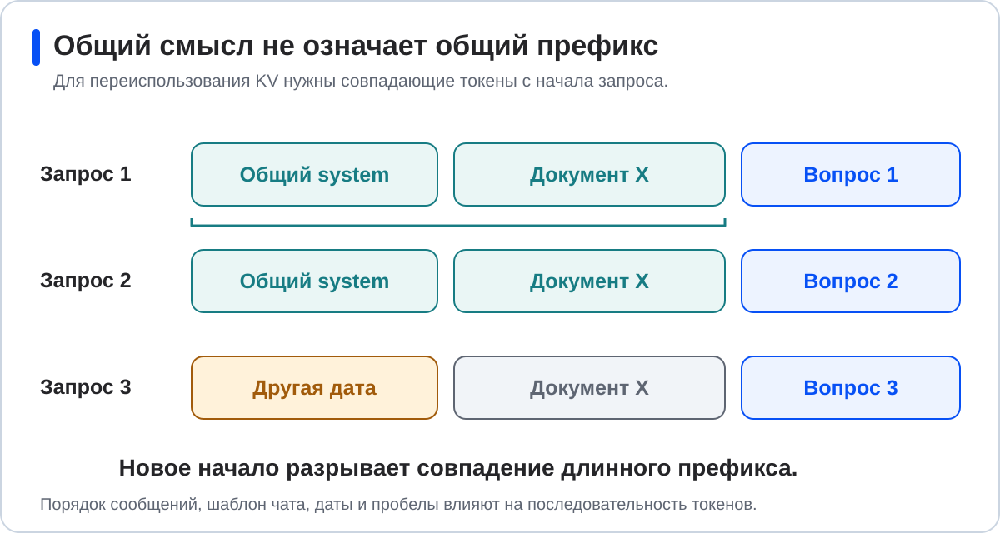

Prefix cache помогает, когда запросы имеют одинаковое начало: системный промпт,
документ, историю. Совпадения только по смыслу недостаточно — переиспользуются
совпадающие токены. Для независимых коротких запросов эффект может быть небольшим.

На второй карте включите [первый профиль B](values/rtx/gemma-cache.yaml):
prefix cache, FP8 KV и 4 GiB CPU KV. Chunked prefill, graphs и assistant
ещё выключены. FP8 относится к KV, веса остаются BF16.

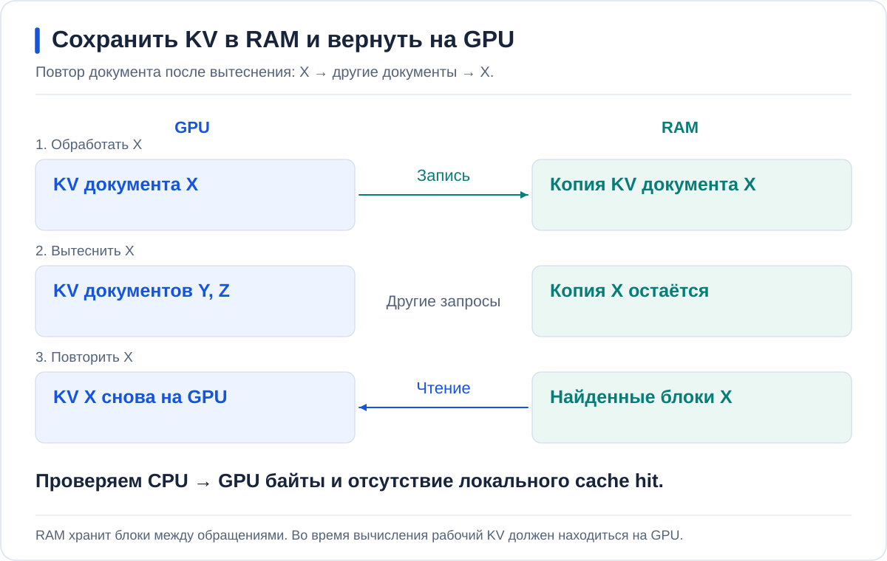

Повторите длинный префикс: должны вырасти GPU cache hits.
Затем вытесните его другими префиксами и повторите исходный запрос:
CPU→GPU bytes вместе с external-prefix hits подтверждают чтение из RAM.
Только запись GPU→CPU этого не доказывает.

Если GPU-кеша хватает на всё, отдельный диагностический опыт уменьшает
его до 256 MiB. После проверки верните штатный размер; результаты диагностики
нельзя смешивать с A/B-замером. KV-offload не является выгрузкой весов модели.

[Включить кеши и проверить восстановление](labs/rtx5060.md#cache)

В `values/gemma-cache.yaml` включите одну реплику; в Application B должен быть
выбран только этот профиль. Примените его через Git/Argo и дождитесь
`deployment/rtx-gemma-tune`. API и WebUI должны продолжать обращаться к тому
же сервису B после следующих изменений. На дашборде сравнивайте именно сервисы,
поскольку веса у A и B одинаковые.

<a id="speculation"></a>
## 5. Вторая итерация: chunked prefill и speculative decoding

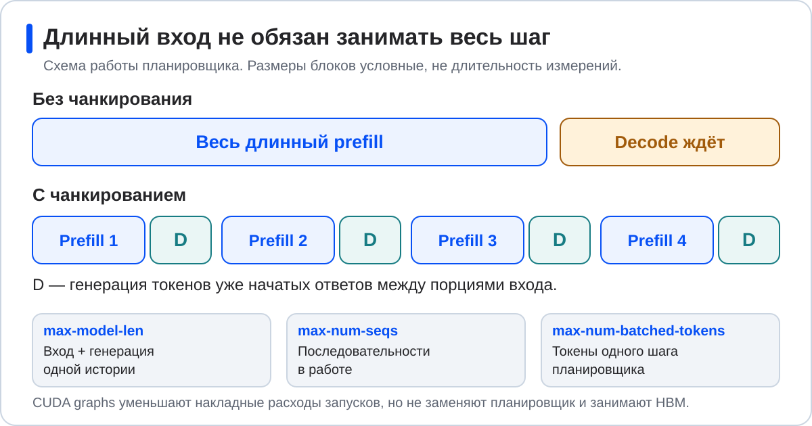

Chunked prefill делит обработку входа на порции. Это позволяет обслуживать decode
уже начатых запросов, пока новый длинный вход ещё обрабатывается.
На RTX бюджет составляет 512 токенов, окно остаётся 4096.

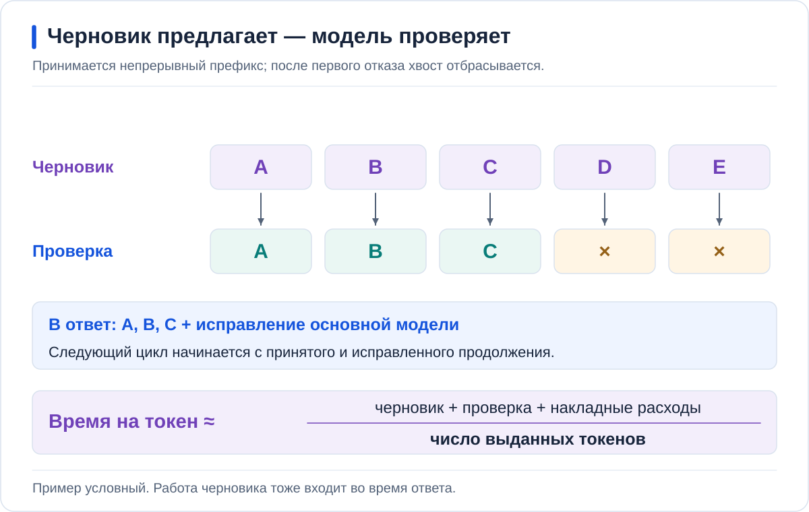

Assistant предлагает один токен за цикл; Gemma проверяет предложение.
Работа механизма видна по счётчикам предложенных и принятых токенов.
Его польза зависит от стоимости предложения, проверки и доли принятия.
Высокая доля принятия сама по себе не доказывает меньшую задержку.

Замените B на [полный второй профиль](values/rtx/gemma-spec.yaml),
сохранив первую итерацию кешей. Он добавляет chunked prefill, совместимый
assistant и CUDA graphs с capture size 4. Не накладывайте два профиля B друг на друга.

Сравните A/B: один seed, 2048 входных, 128 выходных токенов, 8 запросов,
параллельность 2. Раздельно отмечайте холодный и прогретый кеш.
Весь выигрыш полного B нельзя приписать только speculative decoding.

При первом старте B компилируются основная модель и assistant, затем
захватываются CUDA graphs.
NodeCache хранит веса, а не результаты компиляции из временного каталога Pod.
Отсчитывайте готовность по Ready и успешному запросу, не по завершению чтения весов.

[Включить второй профиль](labs/rtx5060.md#speculate) |
[Команда и сырые результаты A/B](labs/rtx5060.md#benchmark)

<a id="long-context"></a>
### Длинный контекст: 64K, затем 128K

Теперь проверим, как обслужить историю, которую контрольный A с окном 4K
не принимает.
Отказ A здесь вызван настроенным лимитом 4K. Он не доказывает нехватку её VRAM
и сам по себе не доказывает необходимость KV-offload.

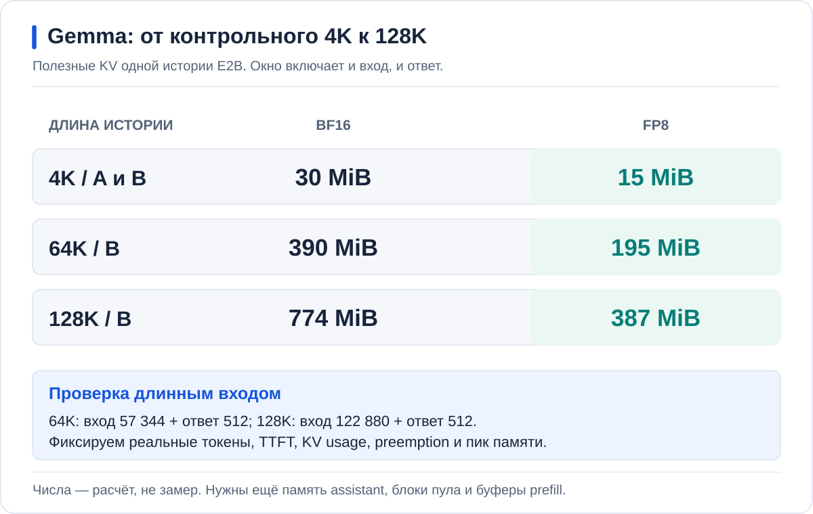

В частном **полном** `values/gemma-spec.yaml` измените
`vllm.max-model-len` на `65536`, а `gpu-memory-utilization` на `0.95`.
При `0.90` первый запуск не прошёл проверку ёмкости KV: после остальных
резервов осталось 0,19 GiB при необходимых 0,20 GiB.
Сохраните assistant, prefix cache, FP8 KV,
CPU KV 4 GiB, graphs и chunked prefill с бюджетом 512. `max-num-batched-tokens`
ограничивает порцию работы, а не общую длину истории — его не нужно поднимать
до 65 536 вместе с окном.

```yaml
# Фрагмент существующего values; остальные поля сохраняются.
vllm:
  max-model-len: 65536
  gpu-memory-utilization: 0.95
  max-num-seqs: 2
  enable-chunked-prefill: true
  max-num-batched-tokens: 512
```

Проверьте Helm render, отправьте diff и синхронизируйте `rtx-gemma-tune`.
После Ready проверьте ConfigMap профиля и checksum Pod, размер KV-пула в логах
и отсутствие ошибок assistant. Один короткий ответ ещё не проверяет новый предел.

Длинный синтетический вход проверяет обработку токенов, а не качество понимания.
Один запрос без параллелизма даёт первую точку по памяти и TTFT:

```bash
export INPUT_TOKENS=57344
export RUN_NAME=gemma-64k
mkdir -p results/rtx
set -o pipefail
kubectl --context "$GPU_CONTEXT" -n "$NS" exec deployment/rtx-gemma-tune -c vllm -- \
  vllm bench serve --backend vllm \
    --base-url "http://rtx-gemma-tune.$NS.svc.cluster.local:8000" \
    --endpoint /v1/completions --model rtx-gemma-tune \
    --tokenizer /data/modelcache/models/rtx-gemma-e2b \
    --dataset-name random --seed 73 \
    --random-input-len "$INPUT_TOKENS" --random-output-len 512 --random-range-ratio 0 \
    --num-prompts 1 --max-concurrency 1 --ignore-eos --temperature 0 \
    --ready-check-timeout-sec 0 --num-warmups 0 \
    --save-result --result-dir /dev --result-filename stdout \
  | tee "results/rtx/$RUN_NAME.txt"
```

Для 64K ожидаем completed=1, failed=0, **57 344 входных + 512 выходных**;
сверяем эти числа с JSON в локальном файле, а не с длиной файла в байтах.
На дашборде выделите интервал запроса: TTFT, KV usage, очередь,
preemption, GPU memory и RAM контейнера. Проверьте, что Pod не перезапускался.

Затем в том же values поставьте `max-model-len: 131072`, повторите Git/Argo
и тест с `INPUT_TOKENS=122880`, `RUN_NAME=gemma-128k`. Ожидаем **122 880 + 512**
токенов. После одиночного запроса повторите серию с двумя независимыми историями;
в той же команде замените параметры на `--seed 88 --num-prompts 2 --max-concurrency 2`
и задайте `RUN_NAME=gemma-128k-concurrent` (для 64K — `gemma-64k-concurrent`).
Результаты длинного входа не смешивайте с коротким A/B.

Наконец отправьте в чат большой текст с заранее известным фактом в середине
и вопросом об этом факте в конце. Убедитесь по usage, что текст не усечён.
RAG, который извлёк несколько коротких фрагментов, не заменяет эту проверку
длинного контекста. Повтор префикса и возврат его KV из RAM — отдельный замер.

Подготовьте такой текст без загрузки чужих документов:

```bash
awk 'BEGIN {
  for (i=0; i<4681; i++) {
    if (i==2340)
      printf "SPECIAL RECORD: The secret verification phrase for project Orion is COPPER-ORCHID-742. "
    else
      printf "Record %d: This routine report describes a successful scheduled health check. There are no special instructions in this record. ", i
  }
  printf "Question: What is the exact verification phrase for project Orion? Reply with only the phrase."
}' > results/rtx/long-context.txt
```

Скопируйте **весь текст** файла в новый чат B, не прикрепляйте его как RAG-документ.
Перед отправкой отключите для этого тестового пользователя автоматические
заголовки, теги и подсказки продолжения: фоновые запросы могут повторить большой
вход и занять его токенный лимит. Ожидаемый ответ — `COPPER-ORCHID-742`.

Проверенные [длинные серии](results/rtx5060-long-20261006.json):

| Окно | Вход на запрос | Запросов одновременно | Средний TTFT | Вся серия |
| --- | ---: | ---: | ---: | ---: |
| 64K | 57 344 | 1 | 12,8 с | 22,5 с |
| 64K | 57 344 | 2 | 18,5 с | 51,9 с |
| 128K | 122 880 | 1 | 42,4 с | 59,4 с |
| 128K | 122 880 | 2 | 63,7 с | 102,4 с |

Все шесть запросов выдали по 512 токенов, без ошибок; Pod не перезапускался.
Компиляция и загрузка в эту длительность не входят. Для параллельной серии
использован другой seed — 88. Это проверка вместимости длинного B,
не сравнение скорости с контрольным A и не изолированный эффект offload.

Через WebUI также прошёл текст с контрольным фактом в середине: **120 619
входных токенов**, 11 выходных, точный ответ за 42,3 секунды; без RAG.
Для этого запроса в настройках тестового пользователя отключены фоновые
заголовки, теги и подсказки продолжения: они могут повторно отправить большой вход.
Текст вставлен одним блоком — многострочная вставка тормозила редактор до отправки.

<a id="platform"></a>
## 6. Gemma через AI Inference

Теперь настройки задаёт рецепт сервиса, а веса — объект `Model` в ai-models.
Перед освобождением карты убедитесь, что поддержана доставка **обоих** артефактов:
Gemma и assistant. Импорт assistant в каталог не означает, что контроллер
InferenceService уже умеет присоединить его к основному заказу.

После проверки остановите ручную A через GitOps и создайте
[`rtx-gemma-platform`](platform/rtx-gemma.yaml). B остаётся на второй карте.
Рецепт должен сохранить **проверенное длинное окно**, одну GPU, prefix cache,
CPU KV, chunked prefill, CUDA graphs и assistant. `Throughput` выбирает рецепт, а состав запуска
проверяется по рассчитанному плану и аргументам Pod.

Параметры runtime берутся из рецепта AI Inference, не из произвольного поля
`InferenceService.spec`. Для подготовленного RTX-рецепта в
`images/catalogs/recipe-presets/compact-mtp.yaml` нужен соответствующий
`maxModelLen` в ветке `throughput` основной и `-default` записи. После штатной
сборки и установки модуля проверьте результат планирования. Если Pod снова
получил 4096, переход на длинный платформенный запуск не выполнен.

В Console откройте **GPU-кластер → hardfest-rtx → AI-модели**:
Gemma должна быть в каталоге, а `rtx-gemma-platform` — в сервисах инференса.
Далее проверьте Ready, ответ API, принятые draft-токены и чат `Gemma A — DP`.
Новый Pod должен использовать те же подготовленные артефакты.

[Заказать Gemma и проверить весь путь](labs/rtx5060.md#platform)

<a id="placement"></a>
## 7. Базы знаний и голос: три сервиса на A30

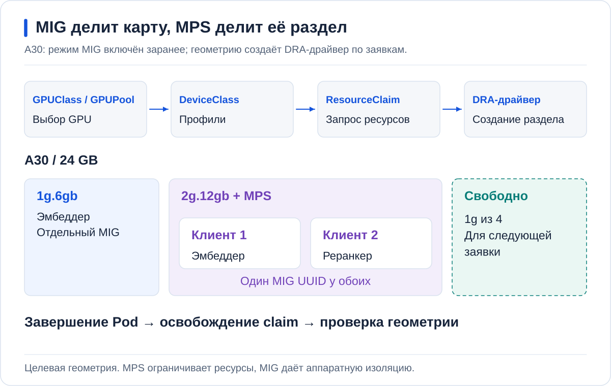

Эта часть не переносится на RTX. В соседнем кластере остаются три
InferenceService: Qwen3 Embedding 4B W4A16, Qwen3 Reranker 4B W4A16
и Whisper large-v3. Их модели также импортируются через ai-models,
но в namespace **кластера A30**, не RTX.

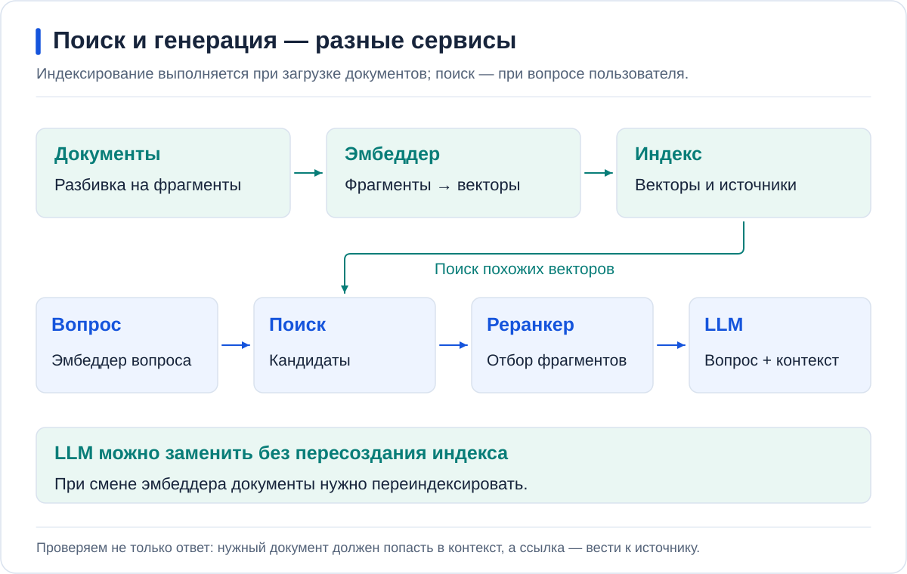

Добавьте документ в базу знаний и задайте вопрос, ответ на который есть в нём.
Проверьте источники, запросы к эмбеддеру/реранкеру и метрики сервиса чата.
Затем отправьте голосовое сообщение и проверьте транскрипцию Whisper.
Смена Gemma на Qwen не требует пересоздавать пользователя или базу знаний.

[Подготовить и проверить три сервиса A30](labs/05-mig-mps.md)

<a id="tp2"></a>
## 8. Qwen через AI Inference: TP2 и MTP

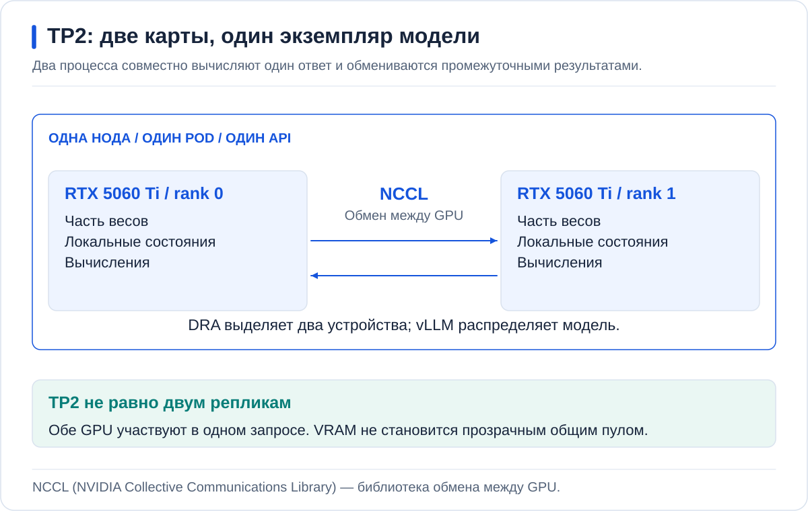

Сначала проверьте `rtx-qwen35-9b` в каталоге и готовность доставки на RTX.
Остановите обе Gemma через их GitOps-приложения, сохранив модели и хранилище.
Убедитесь, что старые DRA-заявки освобождены. Только после этого включайте
[`rtx-qwen35-tp2`](platform/rtx-qwen.yaml).

В рецепте Qwen — **acceleratorCount=2**, `tensor-parallel-size: 2`, BF16,
длинное окно и MTP. DeviceClass выбирает подходящий тип GPU; число карт задаёт
рецепт и подтверждает ResourceClaim. Две реплики по одной GPU — другой опыт.

В подготовке рецепта Qwen также задаётся `maxModelLen`: сначала 65 536,
затем 131 072 после проверки. Проверенный ранее рецепт 8192 нужно обновить,
а не выдавать запуск с ним за длинный контекст. Дочерний StatefulSet не патчим.

В проверенном запуске от создания Pod до Ready прошло **6 минут 36 секунд**.
Веса прочитаны примерно за 6 секунд; оставшееся время включает инициализацию,
компиляцию и прогрев. NodeCache не устраняет эти этапы.

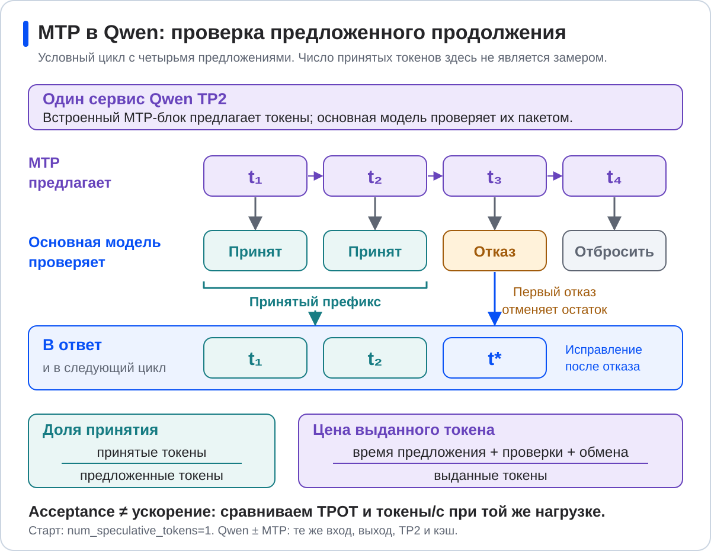

В отличие от Gemma, Qwen использует MTP-веса внутри своего checkpoint.
Начните с одного speculative token. После запроса счётчик принятых токенов
должен увеличиться, но ускорение MTP on/off измеряется отдельно.
На RTX нет NVLink: обмен TP2 нельзя оценивать по цифрам H100.

После короткого ответа повторите длинную проверку на **самом InferenceService**:
входы 57 344 и 122 880 токенов, по 512 выходных. Команды и отдельный расчёт
полного attention Qwen находятся [в лабораторной](labs/rtx5060.md#qwen-long-context).
После API проверьте большой текст в WebUI: шлюз и настройки модели чата
не должны обрезать вход до прежних 8K.

Проверка завершения:

- В каталоге виден `Model rtx-qwen35-9b` с digest, а заказ ссылается на него через `ai-models`.
- `InferenceService Ready`; DRA выделил две разные RTX 5060 Ti, ошибок CUDA нет.
- API возвращает обычный и полный потоковый ответ; метрики MTP меняются.
- Длинные серии завершились без ошибок; сохранены фактические длины, память и TTFT для 64K/128K.
- В WebUI работает `Qwen 9B — TP2`, ответ сохраняется после обновления страницы.
- В ai-mcp-gateway запрос записан на личный VK; дашборд показывает Qwen.

[Заказать Qwen и проверить TP2, MTP и чат](labs/rtx5060.md#tp2)

<a id="cleanup"></a>
## Остановка

Для ручного профиля верните `replicaCount: 0` через GitOps.
Для платформенного — `order.enabled: false` и адресный prune только его
InferenceService по [процедуре остановки](docs/GITOPS.md#остановка).
Проверьте освобождение заявок и скройте неактивные маршруты в WebUI.
Не удаляйте namespace, Models, PVC, пользователей и историю чатов.

<a id="results"></a>
## Результаты измерений

[Замер через NodeCache](results/rtx5060-nodecache-20261006.json):
три серии по восемь запросов для каждого профиля, 2048 входных и 128 выходных
токенов, параллельность 2. Все **72 запроса завершились без ошибок**.

| Профиль | Выходные токены/с, серии 0 / 1 / 2 | Средний TTFT, мс, серии 0 / 1 / 2 |
| --- | --- | --- |
| A — Base | 28,26 / 29,99 / 29,30 | 640 / 338 / 340 |
| B — Cache | 27,63 / 30,58 / 30,77 | 662 / 183 / 197 |
| B — Tune | 142,81 / 204,20 / 204,13 | 525 / 94 / 89 |

Серии 1 и 2 повторяют тот же seed без очистки серверного кеша.
Серия 0 не объявляется чистым холодным стартом: до неё могли быть проверочные
запросы. Из таблицы видно, что кеш сокращает TTFT повторных запросов,
а полный профиль меняет и скорость выдачи. Это не изолированный замер MTP
и не прогноз производительности H100.

Клиенты A и B Cache выполнялись параллельно на общем CPU узла; B Tune — позже.
Это ограничение прикладного прогона. Для изоляции отдельных причин ускорения
нужны последовательные серии с отдельным CPU-клиентом и одинаковым состоянием кеша.

В отдельном опыте с GPU KV 256 MiB после вытеснения исходного префикса
повтор дал **2400 external-prefix hits и 10 518 528 CPU→GPU bytes**.
Это подтверждает [восстановление KV из RAM](results/rtx5060-offload-20261006.json); диагностический размер кеша
не использован в таблице выше.

Выдачу личного VK, доступ к моделям, учёт и отзыв проверьте по
[инструкции подключения чата](docs/CHAT_AND_ACCESS.md#проверить-выдачу-и-отзыв).
Для HA-шлюза отдельно проверяется общий лимит расходов: настройка бюджета
и корректная стоимость отдельного запроса ещё не доказывают его соблюдение.

**Qwen через ai-models → InferenceService → WebUI:**
[новый результат с NodeCache](results/rtx5060-qwen-nodecache-20261006.json).
Три серии по восемь запросов, вход 2048, выход 128, concurrency 2:
72,65 / 100,36 / 100,40 выходных токенов/с; все 24 запроса завершились.
DRA выделил две разные RTX; MTP предлагал и принимал токены.
Замер выполнен с окном **8K**; это не результат длинного Qwen и не коэффициент
ускорения относительно Gemma.

[К содержанию](#contents) | [Стенд H100](README.md) | [Команды RTX](labs/rtx5060.md)
