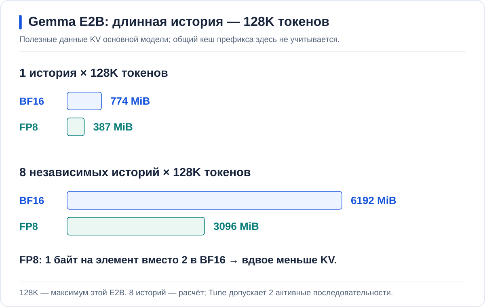

<p align="center">
  <a href="https://github.com/aleksandr-podmoskovniy/hardfest-gpu-workshop">
    
  </a>
</p>

# Инференс без простоя GPU: чиним LLM-сервис руками и делим карту на живом кластере

Александр Подмосковный, Флант / Deckhouse Platform

**Стенд: две RTX 5060 Ti по 16 GiB и A30.** [Вариант с H100](README.md).

`Gemma A — Base` уже работает на первой RTX, вторая свободна.
После регистрации и одобрения в [ai.ap4y.ru](https://ai.ap4y.ru)
Base доступна в чате. Начнём с её ответа, а затем разберём, что меняется под нагрузкой.

<a id="ab"></a>
## 1. Базовая модель под нагрузкой

**Инференс** — обработка запроса моделью.
Она получает текст и строит ответ из токенов — частей слов и знаков.

У Base две активные последовательности. Один запрос может выполняться быстро,
а восемь одновременно — создавать очередь. Первая нагрузка — восемь
одновременных запросов к Base.

<a id="monitoring"></a>
### Очередь, вычисления и память

На дашборде **AI Inference / Service performance** выбираются проект
`hardfest-rtx`, Service `rtx-gemma-base` и интервал нагрузки.
Running / Waiting показывают выполнение и очередь;
рядом сравниваются GPU utilization и занятая память.
Занятая память GPU не означает полную загрузку вычислений.

| Ограничение | Что предстоит изменить |
| --- | --- |
| Память | Уместить длинный контекст и переиспользовать общие данные |
| Вычисления | Сократить обработку входа и генерацию продолжения |
| Размещение | Выделять сервису подходящую часть GPU или несколько карт |

CPU, сеть и шлюз тоже влияют на задержку; графики проверяются вместе.

### Что находится за чатом


**Open WebUI** принимает сообщения. **Bifrost** проверяет доступ и выбирает
маршрут, а **vLLM** исполняет модель. Здесь Gemma A и B используют по одной
RTX 5060 Ti; в финале Qwen занимает обе карты. A30 обслуживает поиск по
документам и распознавание речи.

Запуск через Argo CD, доставка весов и сбор метрик — отдельные задачи,
показанные внизу схемы. [Подготовка стенда](docs/SETUP.md#rtx) связывает их
до первого запроса участника.

### Точка отсчёта

Сравнение Base, Cache и Tune использует одну короткую нагрузку:
**8 запросов, вход 2048, выход 128 токенов, параллельность 2**.
Длинный контекст проверяется отдельно; 128 токенов — лимит замера, не чата.

> [!IMPORTANT]
> Base и Cache — строгие контрольные профили с окном 4K.
> Отключение chunked prefill у Gemma E2B официально не поддерживается.
> Tune использует chunked prefill, окно 128K и до двух активных последовательностей.

<details>
<summary>Профиль Base и воспроизводимая нагрузка</summary>

[Base](values/rtx/gemma-base.yaml) запускается через Helm на vLLM 0.31.
Prefix cache, RAM-offload, CUDA graphs, chunked prefill и speculative decoding
выключены. Значения `GPU_CONTEXT`, `RTX_DIR`, `NS=hardfest-rtx` заданы
при [подготовке](docs/SETUP.md#rtx).

```bash
export SERVICE=rtx-gemma-base SERIES=base-4k-1
# B1: export SERVICE=rtx-gemma-cache SERIES=cache-4k-1
# B2: export SERVICE=rtx-gemma-tune SERIES=tune-128k-short-1
mkdir -p results/rtx
set -o pipefail
kubectl --context "$GPU_CONTEXT" -n "$NS" exec "deployment/$SERVICE" -c vllm -- \
  vllm bench serve --backend vllm \
    --base-url "http://$SERVICE.$NS.svc.cluster.local:8000" \
    --endpoint /v1/completions --model "$SERVICE" \
    --tokenizer /data/modelcache/models/rtx-gemma-e2b \
    --dataset-name random --seed 42 \
    --random-input-len 2048 --random-output-len 128 --random-range-ratio 0 \
    --num-prompts 8 --max-concurrency 2 --ignore-eos --temperature 0 \
    --ready-check-timeout-sec 0 --num-warmups 0 \
    --save-result --result-dir /dev --result-filename stdout \
  | tee "results/rtx/$SERIES.txt"
```

Ожидаемые счётчики: completed=8, failed=0, 16384 входных и 1024 выходных
токена. Первый проход и повтор записываются раздельно: повтор прогревает кеш.

Опыт с очередью отличается только `--max-concurrency 8` и
`SERIES=base-queue-8`: это восемь клиентов при двух активных последовательностях.
Для A/B возвращается параллельность 2, фоновая нагрузка исключается.
Клиент внутри Pod делит CPU с движком; сравнение выполняется одним способом
на всех профилях.

</details>

---

<a id="memory"></a>
## 2. Память: веса и KV-кеш

### Что растёт вместе с чатом

Веса — общие для запросов параметры модели.
**KV cache (Key–Value cache)** хранит ключи и значения обработанных токенов,
чтобы продолжение не вычисляло прошлые K/V заново.

```text
Память GPU ≈ веса + KV-кеш + рабочие буферы
Веса ≈ число параметров × байт на параметр
```

Длинная независимая история требует своего KV, но не копии весов.


### Почему KV зависит от архитектуры

**Attention** связывает токен с контекстом: full attention использует
всю историю, sliding-window attention — последнее окно.
Часть слоёв E2B переиспользует KV других слоёв; это учитывается в расчёте.

Для истории `S ≥ 512` полезный KV основной E2B:

```text
BF16: KV(S) = 6 KiB × S + 6 MiB
FP8:  вдвое меньше
```

**BF16** хранит элемент в двух байтах, **FP8** — в одном.
`S` включает вход и ответ:
например, **122880 + 8192 = 128K**.



**128K — максимум закреплённой E2B.** Восемь историй на схеме — расчёт,
не вместимость этого запуска: профиль ограничен двумя последовательностями.
Общий префикс считается по уникальным блокам, а не умножается на восемь.

<details>
<summary>Полный расчёт KV: слои, размерности и проверка чисел</summary>

В attention запрос Q сравнивается с ключами K; результат определяет
смешивание значений V. Сохраняются K/V, не Q. В GQA (Grouped-Query Attention)
несколько query-голов используют общие KV-головы.

Для одинаковых слоёв:

```text
KV = 2 × b × L × Hkv × D × S × N
```

| Символ | Значение |
| --- | --- |
| `2` | K и V |
| `b` | Байт на элемент |
| `L` | Число слоёв с собственным KV |
| `Hkv`, `D` | Число KV-голов и их размерность |
| `S`, `N` | Длина и число независимых историй |

При разных длинах вместо `S × N` используется их сумма.
В [закреплённой E2B](https://huggingface.co/google/gemma-4-E2B-it/blob/3e22461f65e89153144f8adb70e3b8c2cc9845a7/config.json)
35 слоёв, последние 20 переиспользуют KV. У остальных — одна KV-голова:

| Тип | Слоёв | Размерность | Хранимая длина |
| --- | ---: | ---: | --- |
| Full attention | 3 | 512 | `S` |
| Sliding attention | 12 | 256 | `min(S,512)` |

```text
KV(S) = 2 × b × [3 × 512 × S + 12 × 256 × min(S, 512)] байт
```

При 128K и BF16 полная часть занимает 768 MiB, локальная — 6 MiB.
FP8 уменьшает обе части вдвое.

| История | Одна: BF16 / FP8 | Восемь: BF16 / FP8 |
| --- | ---: | ---: |
| 64K | 390 / 195 MiB | 3120 / 1560 MiB |
| 128K | 774 / 387 MiB | 6192 / 3096 MiB |

```bash
awk -v S=131072 -v N=1 -v b=2 'BEGIN {
  W = S < 512 ? S : 512
  full = 2*b*3*1*512*S / 1048576
  local = 2*b*12*1*256*W / 1048576
  printf "Full %.0f + sliding %.0f = %.0f MiB/history; %d histories = %.0f MiB\n", full, local, full+local, N, N*(full+local)
}'
```

Межслойный sharing и общий префикс разных запросов — разные механизмы.
Расчёт не включает assistant, рабочие буферы и округление блоков.
После весов и буферов запросам доступен KV-пул; его размер берётся из логов,
занятость — из метрик. [Сверка с runtime](docs/MEMORY_BUDGET.md#verify-kv).

</details>

<a id="ram"></a>
### B Cache: один документ, несколько вопросов

Одинаковое начало сообщений не обязательно вычислять повторно.
**Prefix caching** переиспользует его KV — вычисления, не готовый ответ.

**KV-offload** сохраняет блоки в RAM и возвращает при повторном обращении.
RAM при этом не становится дополнительной VRAM для attention.


На второй RTX запускается [B Cache](values/rtx/gemma-cache.yaml):
prefix cache, FP8 KV, 4 GiB RAM KV; окно пока 4K.
**RAM узла должно хватать на оба экземпляра.** Base продолжает работать.

<details>
<summary>Запуск отдельного приложения Cache через Git и Argo CD</summary>

В `$RTX_DIR/values/gemma-cache.yaml` задаётся `replicaCount: 1`.

```bash
set -o pipefail
helm template rtx-gemma-cache "$RTX_DIR/charts/vllm-runtime" -n "$NS" \
  -f "$RTX_DIR/values/gemma-cache.yaml" |
  kubectl --context "$GPU_CONTEXT" apply --dry-run=server -f -
```

```bash
git add -- "$RTX_DIR/values/gemma-cache.yaml"
git diff --cached --check
git diff --cached
git commit -S -s -m "Start RTX Gemma with prefix cache and RAM KV"
git push
git rev-parse HEAD
```

В Argo CD `rtx-gemma-cache` синхронизируется с напечатанным SHA,
без общего Prune. После Ready и ответа API включается `Gemma B — Cache` в WebUI.
Последующие изменения используют тот же путь:
render → commit/push → адресный Sync, без прямого scale поверх GitOps.

</details>

Два новых чата получают одинаковый сырой текст около 2000 токенов
**в начале сообщения**, но разные вопросы в конце — без вложений и поиска
по базе знаний. Сравниваются время до первого токена (**TTFT**)
и попадания в prefix cache.

Для проверки RAM исходный префикс вытесняется другими запросами, затем повторяется.
**CPU→GPU bytes и external-prefix hits** подтверждают возврат;
GPU→CPU доказывает только запись.
[Воспроизводимый опыт](docs/MEASUREMENTS.md#offload-replay) отделён от рабочего A/B.

Повтор короткой серии сравнивает задержку и очередь.
Новый вход и ответ всё ещё требуют вычислений.

---

<a id="speculation"></a>
## 3. Вычисления: prefill и decode

<a id="latency"></a>
### Две разные причины ожидания

**Prefill** обрабатывает вход и строит KV; **decode** генерирует продолжение.
Рассуждение модели, reasoning, тоже относится к decode и расходует выходные токены.

```text
Tответа ≈ Tочереди + Tprefill + Tdecode + Tпрочее
```

Prefill обрабатывает токены параллельно, decode — последовательно.
Длинный вход может задержать соседний запрос, даже когда памяти достаточно.

### Длинный вход по частям

**Chunked prefill** делит вход на порции и позволяет чередовать
их с decode начатых ответов.


Следом за длинным запросом приходит короткий. Сначала на Cache,
затем на Tune сравнивается, сколько короткий запрос ждал своей очереди.
Маленькая порция требует больше шагов для самого входа.
Поэтому сравниваются оба запроса: TTFT и
**ITL** — интервалы между выходными токенами.

### Продолжение с черновиком

В **speculative decoding** маленькая draft-модель предлагает токены,
основная target-модель проверяет их за проход: принимает подходящее
начало и исправляет продолжение после отказа.

У Gemma нужен совместимый **assistant**, не любая маленькая модель.
Здесь используется MTP (Multi-Token Prediction) с одним предлагаемым токеном.
Черновик тоже стоит вычислений: доля принятых токенов сама по себе не доказывает ускорения.

### B Tune вместо Cache

[Tune](values/rtx/gemma-spec.yaml) сохраняет кеши и добавляет chunked prefill,
assistant и **CUDA graphs** — переиспользуемую последовательность операций GPU.
Окно сразу **128K**, лимит ответа в чате — **8192**.

**Cache сначала завершает текущие запросы и освобождает карту; затем запускается
отдельное приложение Tune.** Base остаётся. Два варианта B не работают одновременно.

<details>
<summary>Переключение приложений и параметры Tune</summary>

До остановки Cache выполняется пара: **3072 входных токена, через 50 мс —
128 токенов; выход обоих — 128**. Та же пара затем повторяется на Tune.
[Штатный клиент vLLM с расписанием](docs/MEASUREMENTS.md#mixed-prefill)
сохраняет фактические времена: назначенная задержка ещё не доказывает перекрытия.

| Приложение | Рабочий файл | Изменение |
| --- | --- | --- |
| `rtx-gemma-cache` | `values/gemma-cache.yaml` | `replicaCount: 0` |
| После освобождения GPU: `rtx-gemma-tune` | `values/gemma-spec.yaml` | `replicaCount: 1` |

Каждый шаг проходит render, commit/push и Sync своего приложения.
Tune — полный профиль, не дополнительный values поверх Cache.

```yaml
# Параметры готового Tune, не дополнительное расширение окна.
vllm:
  max-model-len: 131072
  gpu-memory-utilization: 0.95
  max-num-seqs: 2
  enable-chunked-prefill: true
  max-num-batched-tokens: 512
```

Дополнительно: FP8 KV, 4 GiB RAM KV, CUDA graphs capture size 4.
Значение `0.95` использовано в успешном прогоне; при `0.90` проверка ёмкости KV
не прошла. Бюджет шага 512 — размер порции, не предел входа.

Маршрут Cache скрывается до остановки. После Ready и ответа Tune
включается `Gemma B — Tune`: Service `rtx-gemma-tune:8000`,
served model `rtx-gemma-tune`. Личный ключ не заменяется.
Первый запуск включает компиляцию; NodeCache хранит веса, не её временные результаты.

</details>

Tune отвечает на тот же вопрос; короткая и смешанная серии сравниваются
с Cache по графикам. Это эффект **набора настроек**, не отдельной оптимизации.

<a id="long-context"></a>
### Проверка 128K отдельно от короткого A/B

**Вход, шаблон и лимит ответа вместе должны помещаться в окно Tune 128K.**
Отказ Base принять длинную историю означает лимит 4K, не нехватку VRAM.

Для проверки содержания блок ниже создаёт **учебный документ с контрольным
фактом в середине**. Он передаётся целиком сообщением, не выборкой RAG.
Правильный ответ, цитата и фактическая длина входа в журнале проверяют этот
конкретный пример. Синтетические серии перед ним проверяют только вместимость
и длину выхода — не понимание текста.

<details>
<summary>Длинные входы, ответ 8192 и контрольный факт в тексте</summary>

```bash
export INPUT_TOKENS=57344 OUTPUT_TOKENS=512
export RUN_NAME=gemma-long-input
mkdir -p results/rtx
set -o pipefail
kubectl --context "$GPU_CONTEXT" -n "$NS" exec deployment/rtx-gemma-tune -c vllm -- \
  vllm bench serve --backend vllm \
    --base-url "http://rtx-gemma-tune.$NS.svc.cluster.local:8000" \
    --endpoint /v1/completions --model rtx-gemma-tune \
    --tokenizer /data/modelcache/models/rtx-gemma-e2b \
    --dataset-name random --seed 73 \
    --random-input-len "$INPUT_TOKENS" --random-output-len "$OUTPUT_TOKENS" --random-range-ratio 0 \
    --num-prompts 1 --max-concurrency 1 --ignore-eos --temperature 0 \
    --ready-check-timeout-sec 0 --num-warmups 0 \
    --save-result --result-dir /dev --result-filename stdout \
  | tee "results/rtx/$RUN_NAME.txt"
```

| Серия | Вход | Выход | `RUN_NAME` |
| --- | ---: | ---: | --- |
| Первая | 57344 | 512 | `gemma-long-input` |
| Вторая | 122880 | 512 | `gemma-128k` |
| Длинный ответ | 122880 | 8192 | `gemma-long-output` |

Перед следующим запуском меняются `INPUT_TOKENS`, `OUTPUT_TOKENS` и имя
результата. Критерии: completed=1, failed=0, заданные фактические длины,
без перезапусков. Эти серии проверяют ёмкость; качество ответа проверяется отдельно.

```bash
mkdir -p results/rtx
awk 'BEGIN {
  for (i=0; i<4681; i++) {
    if (i==2340)
      printf "SPECIAL RECORD: The secret verification phrase for project Orion is COPPER-ORCHID-742. "
    else
      printf "Record %d: This routine report describes a successful scheduled health check. There are no special instructions in this record. ", i
  }
  printf "Question: What is the exact verification phrase for project Orion? Reply with only the phrase."
}' > results/rtx/long-context.txt
```

В чат передаётся весь текст файла, не вложение для поиска фрагментов.
В журнале проверяется фактическая длина; ожидается `COPPER-ORCHID-742`.
Для этой фразы достаточно `max_tokens: 128`, обычный чат сохраняет лимит 8192.
Фоновые заголовки, теги и подсказки временно выключены: они могут повторно
отправлять длинный вход.

</details>

Вне стенда остаются [prefill/decode disaggregation](https://docs.vllm.ai/en/v0.31.0/features/disagg_prefill/) —
разные исполнители стадий с передачей KV — и
[cache-aware routing](https://docs.dynamo.nvidia.com/dynamo/knowledge-base/concepts/system-architecture/kv-aware-routing) —
выбор реплики с нужным кешем.
Теперь движок настроен; осталось понять, сколько именно GPU ему выделять.

---

<a id="placement"></a>
## 4. Размещение моделей на GPU

### От целой карты к заявке на ресурс

Небольшой сервис может удерживать почти пустую карту.
Тогда нужна не настройка генерации, а другое выделение устройств.

**Device Plugin** публикует целочисленные ресурсы, например
`nvidia.com/gpu: 1`. Такой запрос задаёт количество, а не выбор по произвольным
атрибутам. Реализации могут дополнительно поддерживать MIG и совместное использование.

**DRA (Dynamic Resource Allocation)** отделяет заявку ResourceClaim от Pod.
Класс DeviceClass и атрибуты помогают выбрать устройство и передать настройки драйверу.
[Авторский разбор](https://habr.com/ru/companies/flant/articles/1020276/) и
[документация Kubernetes](https://kubernetes.io/docs/concepts/resource-management/dynamic-resource-allocation/).

### Три сервиса на A30

| Механизм | Что разделяет |
| --- | --- |
| MIG — Multi-Instance GPU | Аппаратные части со своей долей памяти и вычислений |
| MPS — Multi-Process Service | Совместное выполнение процессов, без новой аппаратной границы памяти |


В соседнем кластере A30 подготовлены три модели:

| Модель | Работа | Размещение |
| --- | --- | --- |
| Qwen3 Embedding 4B W4A16 | Текст в векторы для поиска | Первая MIG-часть, MPS |
| Qwen3 Reranker 4B W4A16 | Пересортировка найденного | Та же часть, MPS |
| Whisper large-v3 | Преобразование речи в текст | Вторая MIG-часть |

W4A16 означает 4-битные веса и 16-битные активации.
У первых двух сервисов должен совпасть MIG UUID — идентификатор части;
у Whisper он другой.

**DRA сам не нарезает любую карту: нужны поддержка оборудования и драйвера.
MIG mode включён заранее; чужие workloads и режим карты не меняются.**
Готовая геометрия ещё не доказывает её динамическое создание.

<details>
<summary>Проверка частей карты и первоначальное создание сервисов</summary>

На узле A30 выполняются только читающие команды:

```bash
nvidia-smi -L
nvidia-smi mig -lgi
nvidia-smi mig -lci
```

[Проверка заявок и процессов](docs/TROUBLESHOOTING.md#a30-claims)
сопоставляет модели, UUID и MPS. Консоль и источник метрик относятся к A30,
не к RTX. [Создание заказов](#a30-orders) разобрано ниже, после автоматизации;
сравнение до и после их применения проверяет изменение геометрии.

</details>

### Поиск и голос в одном запросе

**RAG (Retrieval-Augmented Generation)** добавляет к вопросу найденные фрагменты.
Документ с фактом «В проекте “Липа” окно обслуживания начинается во вторник
в 16:40» загружается в базу знаний WebUI, индексируется, база подключается к чату.

Одинаковый вопрос без базы и с ней проверяет, откуда модель получила факт.
Нужны точный ответ, ссылка на источник и обращения к эмбеддеру и реранкеру.
Голосовой вопрос дополнительно проверяет транскрипцию Whisper.

Мы подобрали параметры движка и размещение. Повторять этот подбор для каждой
новой модели вручную — следующая проблема.

---

<a id="platform"></a>
## 5. Автоматический запуск через AI Inference

### От модели к плану

**ai-models** хранит каталог и доставляет закреплённые веса.
**InferenceService** — заказ на запуск; планировщик AI Inference выбирает
совместимый рецепт по модели, требованиям и оборудованию.

| Вход планировщика | Что он учитывает |
| --- | --- |
| Модель | Архитектуру и потребность в памяти |
| Заказ | Контекст, стратегию и ограничения |
| GPU | Память, число устройств и возможности |
| Рецепты | Подходящие параметры движка |

В каталоге `hardfest-rtx` скачанная Gemma доступна через
**«Запустить инференс»**. После выбора доступной стратегии и ресурсов
рассчитывается план; подготовка и работа экземпляра видны в «Сервисах инференса».

### Платформенная Gemma вместо Base

Нужен рецепт Throughput: vLLM 0.31, **128K, две последовательности,
FP8 KV, 4 GiB RAM KV и assistant**. Веса и assistant доставлены; **RAM должно хватать на обе Gemma.**

Base завершает запросы и освобождает GPU. Её занимает платформенная Gemma;
ручная Tune остаётся. Здесь тот же заказ хранится в Git и применяется Argo CD —
второй экземпляр через UI не создаётся.

<details>
<summary>Заказ, маршрут в WebUI и запрос к API</summary>

После остановки Base через GitOps в
`$RTX_DIR/platform/rtx-gemma.yaml` задаётся `order.enabled: true`.

```bash
set -o pipefail
helm template rtx-gemma-platform "$RTX_DIR/charts/inference-service" -n "$NS" \
  -f "$RTX_DIR/platform/rtx-gemma.yaml" |
  kubectl --context "$GPU_CONTEXT" apply --dry-run=server -f -
```

Далее commit/push и Sync `rtx-gemma-platform`.
После Ready и ответа API включается `Gemma A — DP` вместо Base:
Service `rtx-gemma-platform:80`, модель `rtx-gemma-e2b`.
DP здесь — название платформенного варианта.

Для проверки API в отдельном терминале:

```bash
kubectl --context "$GPU_CONTEXT" -n "$NS" port-forward svc/rtx-gemma-platform 18005:80
```

При политике Token ключ вводится из менеджера секретов,
не помещается в Git или аргументы командной строки:

```bash
set +x
IFS= read -r -s MODEL_API_KEY
curl --fail --max-time 30 \
  --header @<(printf 'Authorization: Bearer %s\n' "$MODEL_API_KEY") \
  http://127.0.0.1:18005/v1/models
curl --fail-with-body --max-time 180 \
  --header @<(printf 'Authorization: Bearer %s\n' "$MODEL_API_KEY") \
  -H 'Content-Type: application/json' http://127.0.0.1:18005/v1/chat/completions \
  -d '{"model":"rtx-gemma-e2b","max_tokens":512,"temperature":0,"messages":[{"role":"user","content":"Зачем нужен KV-кеш?"}]}'
unset MODEL_API_KEY
```

Запросы выполняются в основном терминале; затем port-forward закрывается.
Для API без Token ввод ключа и заголовки авторизации отсутствуют.
Политика ради теста не меняется.

Окно 4096 вместо 131072 означает неверный рецепт.
Обе Gemma проверяются одним [CPU-клиентом](docs/MEASUREMENTS.md#gemma-client-rtx):
одинаковые короткие и длинные входы, первый проход и повтор,
раздельные файлы результатов. В дашборде доступны оба Service.
[Связь каталога, доставки и сервиса](assets/23-rtx-platform.svg).

</details>

Одинаковый вопрос к Tune и `Gemma A — DP` проверяет ответ,
нагрузка — очередь и задержки. Автоматизация воспроизводит настройки,
но сама по себе не ускоряет модель.

<a id="a30-orders"></a>
<details>
<summary>Как создаются подготовленные сервисы A30</summary>

Это тоже InferenceService, не ручные runtime.
Модели импортированы через ai-models в кластер A30;
для изменения геометрии нужны свободные ресурсы, поддержка драйвера
и включённый MIG mode. Чужие workloads не вытесняются.

В `$A30_DIR/platform/embedding.yaml`, `reranker.yaml`, `whisper.yaml`
задаётся `order.enabled: true`. После render и commit/push синхронизируются
`hardfest-embedding-platform`, `hardfest-reranker-platform`,
`hardfest-whisper-platform`; destination — A30.

Вывод `nvidia-smi` до применения заказов сравнивается с выводом после Ready.
Повторный Sync готовых частей не доказывает их создание.
Запросы поиска и речи из раздела 4 завершают проверку.

</details>

---

<a id="conclusion"></a>
## 6. Сначала оптимизация, затем новые GPU

Кеш сокращает повторную работу, движок распределяет вычисления,
MIG/MPS разделяют карту между сервисами. Автоматизация воспроизводит этот подбор.

Новые GPU нужны, если после настройки остаются неприемлемая очередь,
задержка или нехватка вместимости при заданной нагрузке.
Закупку обосновывают эти показатели, не один процент утилизации.

---

<a id="topology"></a>
## 7. Шлюз: чей запрос и сколько он потребил

WebUI обращается к моделям через **ai-mcp-gateway и Bifrost**.
Личный **VK (Virtual Key)** связывает пользователя с доступами, лимитами и учётом;
после одобрения аккаунта он создаётся автоматически.
Это не ключ подключения шлюза к vLLM.

В журнале запроса видны владелец, модель, входные и выходные токены,
расчётная стоимость. У двух пользователей должны быть разные личные ключи;
смена модели сохраняет пользователя, историю и подключённую базу знаний.
Тарифы стенда условные, деньги не списываются.
[Политика доступа и ограничения учёта](docs/CHAT_AND_ACCESS.md).

Остаётся случай, который не решить выделением доли GPU:
сама модель больше памяти одной карты.

---

<a id="tp2"></a>
## 8. Большая модель на двух GPU

### Почему Qwen нужны обе RTX

Языковые веса Qwen3.5-9B вместе с MTP занимают около **17,13 GiB**,
одна RTX предоставляет около **15,93 GiB**.
**TP2 (Tensor Parallelism)** распределяет одну модель между двумя GPU:
это одна модель, а не две независимые реплики.


У Qwen MTP находится в основном checkpoint, отдельный assistant не нужен.
Рецепт задаёт один предлагаемый токен, **128K, до восьми активных
последовательностей, FP8 KV и 16 GiB RAM-offload**.

**До остановки Gemma должны быть готовы Model `rtx-qwen35-9b`,
доставка и рецепт TP2/MTP с окном 128K.** После завершения запросов обе GPU
освобождаются. **Prune применяется только к отключаемому InferenceService;
Models, PVC и данные не удаляются.**

<details>
<summary>Остановка Gemma и запуск Qwen через AI Inference</summary>

Ручная Tune получает `replicaCount: 0` через GitOps.
Платформенная Gemma — `order.enabled: false` и адресный
**Prune только её InferenceService**; обычного Sync для удаления недостаточно.

После освобождения двух GPU в `$RTX_DIR/platform/rtx-qwen.yaml`
задаётся `order.enabled: true`.

```bash
set -o pipefail
helm template rtx-qwen35-tp2 "$RTX_DIR/charts/inference-service" -n "$NS" \
  -f "$RTX_DIR/platform/rtx-qwen.yaml" |
  kubectl --context "$GPU_CONTEXT" apply --dry-run=server -f -
```

Commit/push и Sync `rtx-qwen35-tp2`.
В плане, ResourceClaim и Pod проверяются две GPU,
`tensor-parallel-size: 2` и окно 131072.
Параметры задаёт рецепт; дочерний StatefulSet вручную не меняется.

После ответа API включается `Qwen 9B — TP2`:
Service `rtx-qwen35-tp2:80`, модель `rtx-qwen35-9b`.
Для проверки API подходит процедура Gemma с этим Service, моделью и её ключом.

</details>

<a id="qwen-long-context"></a>
### Окно 128K не означает восемь полных окон

Full-attention KV Qwen с MTP требует **1,125 GiB на GPU для одной истории 128K**.
Восемь таких историй — уже **9 GiB на GPU**, без весов и остальных буферов.

**Восемь полных историй 128K с весами в этих RTX не помещаются.**
RAM-offload не расширяет рабочую память attention.
Поэтому отдельно проверяются один длинный вход и восемь входов по 32K.

<details>
<summary>Расчёт KV и воспроизводимые длинные серии</summary>

В [закреплённой Qwen](https://huggingface.co/Qwen/Qwen3.5-9B/blob/c202236235762e1c871ad0ccb60c8ee5ba337b9a/config.json)
8 full-attention и 24 linear-attention слоя.
У full — 4 KV-головы размерности 256;
[MTP добавляет ещё один full-слой](https://github.com/vllm-project/vllm/blob/v0.31.0/vllm/model_executor/models/qwen3_5_mtp.py#L111).
TP2 оставляет две головы на GPU.

```text
KV на GPU = 2 × 1 × 9 × (4 / 2) × 256 × S × N байт
```

`S` — вся история, `N` — независимые истории.
Произведение `2 × 1 × 9 × 2 × 256` даёт 9216 байт,
или 9 KiB на токен на GPU.

| История | Одна на GPU | Восемь на GPU |
| --- | ---: | ---: |
| 32K | 0,28125 GiB | 2,25 GiB |
| 128K | 1,125 GiB | 9 GiB |
| 256K, только расчёт | 2,25 GiB | 18 GiB |

Состояние linear attention, веса, буферы и округление добавляются отдельно.
Конфигурация модели допускает 262144 позиции, рецепт стенда — 128K.

При Token клиенту нужен `OPENAI_API_KEY` из Secret.
Если его нет в runtime, используется подготовленный CPU-клиент с авторизацией;
проверка доступа не отключается. При нескольких контейнерах runtime выбирается через `-c`.

```bash
export INPUT_TOKENS=57344 RUN_NAME=qwen-64k
mkdir -p results/rtx
set -o pipefail
kubectl --context "$GPU_CONTEXT" -n "$NS" exec rtx-qwen35-tp2-0 -- \
  vllm bench serve --backend vllm \
    --base-url "http://rtx-qwen35-tp2.$NS.svc.cluster.local" \
    --endpoint /v1/completions --model rtx-qwen35-9b \
    --tokenizer /data/modelcache/models/rtx-qwen35-9b \
    --dataset-name random --seed 73 \
    --random-input-len "$INPUT_TOKENS" --random-output-len 512 --random-range-ratio 0 \
    --num-prompts 1 --max-concurrency 1 --ignore-eos --temperature 0 \
    --ready-check-timeout-sec 0 --num-warmups 0 \
    --save-result --result-dir /dev --result-filename stdout \
  | tee "results/rtx/$RUN_NAME.txt"
```

| Серия | Изменения параметров | Критерии |
| --- | --- | --- |
| Длинный вход | 57344, затем `INPUT_TOKENS=122880 RUN_NAME=qwen-128k` | completed=1, failed=0; заданный вход + 512 |
| Восемь запросов | `INPUT_TOKENS=32768`, seed 107, `--num-prompts 8 --max-concurrency 8`, `RUN_NAME=qwen-8-sessions` | completed=8, failed=0; 262144 входных + 4096 выходных |

Одновременность подтверждается Running / Waiting, не числом успешных клиентов.
Сохраняются также вытеснения и перезапуски.

</details>

В WebUI Qwen проверяется законченным ответом и сохранённой историей,
в шлюзе — запросом под личным VK.
Возврат префикса подтверждает RAM-offload, принятые draft-токены — MTP.
Результат всей настройки — работающий пользовательский запрос.

<a id="results"></a>
### Результаты и завершение

[Сырые результаты прогона](results/rtx5060-rehearsal-20261008.json)
содержат конфигурации, A/B, длинные входы и Qwen 8×32K.
Новый запуск сохраняет свои результаты: опубликованные числа не заменяют его измерения.

<a id="cleanup"></a>
<details>
<summary>Остановка и возврат к исходному состоянию</summary>

Маршруты скрываются от новых запросов, текущие завершаются.
Ручные профили получают `replicaCount: 0`;
заказы — `order.enabled: false` и адресный Prune только нужных InferenceService
по [процедуре GitOps](docs/GITOPS.md#остановка).
**Namespace, Models, PVC, пользователи и чаты сохраняются.**

Для следующего прогона запускается только Base; Cache и Tune остаются
отдельными выключенными приложениями.
Tune сохраняет окно 128K и лимит ответа WebUI 8192.

</details>

<a id="setup"></a>
<details>
<summary>Что подготовлено до начала</summary>

[Подготовка RTX](docs/SETUP.md#rtx) задаёт контексты и каталоги частного Git.
Веса E2B, assistant и Qwen доставлены; RAM рассчитана на две Gemma.
A30 подготовлена по [заказам](#a30-orders).
Base отвечает новому одобренному пользователю, её метрики собираются;
Cache, Tune, платформенная Gemma и Qwen выключены.

NodeCache хранит веса, но не заменяет загрузку образа runtime.
Публичные профили выключены по умолчанию; секреты не помещаются в Git.

</details>

<a id="contents"></a>
[Нагрузка](#ab) | [Память](#memory) | [Вычисления](#speculation) |
[Размещение](#placement) | [Автоматизация](#platform) | [Вывод](#conclusion) |
[Шлюз](#topology) | [TP2](#tp2)
