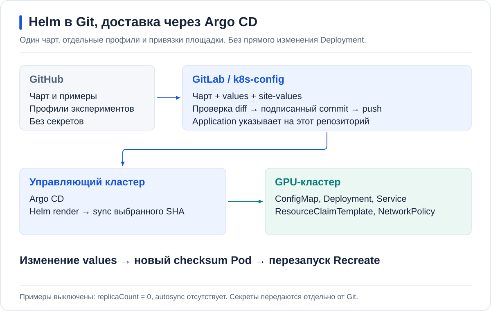

# Развёртывание через GitLab и Argo CD



В GitLab хранится версия стенда: чарт, профиль движка и привязка к площадке.
Argo CD в управляющем кластере читает её и создаёт ресурсы в GPU-кластере.
Helm здесь рендерит YAML; отдельного Helm release нет.

## Перед началом

- Пройдена [проверка стенда](SETUP.md): namespace, PVC, DRA и доступы готовы.
- Рабочая директория — корень **частной репы `k8s-config`**.
- Клон `hardfest-gpu-workshop` находится рядом с ней.
- На рабочей машине есть Git, Helm 3+ и kubectl. YAML редактируется в редакторе.

> [!IMPORTANT]
> Не выполняйте `helm upgrade`, `kubectl scale` и ручное редактирование Deployment
> поверх Argo. Все изменения runtime проходят через values, commit, push и sync.

## 1. Задать контексты

```bash
export ARGO_CONTEXT=management
export GPU_CONTEXT=gpu-cluster
export MIG_CONTEXT=a30-cluster
export A30_DIR=argo-projects/a30-cluster/hardfest-demo
export ARGO_NAMESPACE=argocd
export DEMO_DIR=argo-projects/gpu-cluster/hardfest-demo
set -o pipefail

kubectl --context "$ARGO_CONTEXT" -n "$ARGO_NAMESPACE" get applications
kubectl --context "$GPU_CONTEXT" get nodes,deviceclasses
kubectl --context "$GPU_CONTEXT" -n hardfest-demo get pvc
```

Проверьте, что первый контекст ведёт в кластер Argo, второй — в кластер моделей.
Не добавляйте токен GitLab в `repoURL`: доступ к репозиторию настраивается в Argo.

## 2. Скопировать чарт и values в k8s-config

Этот блок предназначен для **нового** каталога. Если стенд уже существует,
обновляйте файлы через просмотр diff, не перезаписывайте `site/`.

```bash
git switch -c hardfest-demo
mkdir -p "$DEMO_DIR/charts" "$DEMO_DIR/values" "$DEMO_DIR/site" "$DEMO_DIR/argo-app"
cp -R ../hardfest-gpu-workshop/charts/vllm-runtime "$DEMO_DIR/charts/"
cp ../hardfest-gpu-workshop/values/*.yaml "$DEMO_DIR/values/"
cp ../hardfest-gpu-workshop/examples/site-gemma-catalog.yaml "$DEMO_DIR/site/gemma.yaml"
cp ../hardfest-gpu-workshop/examples/site-gemma-assistant-catalog.yaml "$DEMO_DIR/site/gemma-assistant.yaml"
cp ../hardfest-gpu-workshop/argocd/gemma-a.yaml "$DEMO_DIR/argo-app/"
cp ../hardfest-gpu-workshop/argocd/gemma-b.yaml "$DEMO_DIR/argo-app/"
```

Каталог моделей добавляется отдельным Application по
[инструкции ai-models](../catalog/README.md). Здесь настраиваются только ручные A/B.

## 3. Заполнить site-файлы и Application

Откройте перечисленные файлы в редакторе. В публичных примерах нет реальных
адресов, имён PVC и DeviceClass вашего кластера.

| Файл относительно `$DEMO_DIR` | Что заменить | Как проверить |
| --- | --- | --- |
| `site/gemma.yaml` | Ноду, DeviceClass, имя Model и путь cache | `get nodes,deviceclasses` и готовность Model на ноде |
| `site/gemma-assistant.yaml` | Те же поля и оба modelRefs, включая assistant | Оба каталога весов доступны Pod |
| `site/*.yaml` | Tolerations и ingress от шлюза/мониторинга | Сверить taints и сетевые политики площадки |
| `argo-app/gemma-a.yaml`, `argo-app/gemma-b.yaml` | `repoURL`, `targetRevision`, `project`, `source.path`, `destination` | Git доступен Argo, проект разрешает destination |

В каждом Application путь `source.path` должен вести к
`argo-projects/gpu-cluster/hardfest-demo/charts/vllm-runtime` либо вашему
эквиваленту. `destination.name` — имя зарегистрированного кластера Argo,
не обязательно имя kubectl-контекста.

У B оставьте такой порядок файлов:

```yaml
helm:
  releaseName: hf-gemma-b
  valueFiles:
    - ../../values/gemma-b.yaml
    - ../../site/gemma.yaml
```

В `site/` находятся привязки площадки. Не добавляйте туда `replicaCount`,
параметры производительности, `resources` или `shmSize`: они перекроют профиль.
Допустимые переопределения `vllm` здесь — только пути `model` и
`speculative-config.model`. Используйте **один полный профиль и один site-файл**.
Списки Helm заменяет целиком: assistant site содержит оба `modelRefs`.

Вариант с заранее подготовленным PVC остаётся в `examples/site-gemma.yaml`
и `examples/site-gemma-assistant.yaml`. Выберите один источник весов:
`modelRefs` (ai-models) или `modelVolumes` (PVC), не оба сразу.

Все профили пока оставьте с `replicaCount: 0`. Autosync и общий prune не включайте.

## 4. Проверить и отправить первую ревизию

```bash
for SLOT in a b; do
  helm lint "$DEMO_DIR/charts/vllm-runtime" --strict \
    -f "$DEMO_DIR/values/gemma-$SLOT.yaml" -f "$DEMO_DIR/site/gemma.yaml" || exit 1
  helm template "hf-gemma-$SLOT" "$DEMO_DIR/charts/vllm-runtime" -n hardfest-demo \
    -f "$DEMO_DIR/values/gemma-$SLOT.yaml" -f "$DEMO_DIR/site/gemma.yaml" |
    kubectl --context "$GPU_CONTEXT" apply --dry-run=server -f - || exit 1
done
git diff -- "$DEMO_DIR"
git add -- "$DEMO_DIR"
git diff --cached --check
git diff --cached --stat
git diff --cached -- "$DEMO_DIR"
git commit -S -s -m "Add HardFest Helm chart and profiles"
git push -u origin hardfest-demo
```

До commit проверьте **полный staged diff**, а не только stat. В нём не должно
быть токенов и Secret с открытыми значениями. `-S -s` использует ваш настроенный
ключ подписи и добавляет DCO sign-off.

Чарт создаёт runtime-ресурсы с нулём реплик. Namespace, PVC, GPUClass и DeviceClass
он не создаёт. Server dry-run не проверяет наличие весов и работу CUDA.

## 5. Зарегистрировать Application и синхронизировать

Если `argo-app/` уже управляется родительским Application, доставьте изменения
через него. Иначе зарегистрируйте новые Application в **управляющем** кластере:

```bash
kubectl --context "$ARGO_CONTEXT" -n "$ARGO_NAMESPACE" apply --dry-run=server -f "$DEMO_DIR/argo-app/"
kubectl --context "$ARGO_CONTEXT" -n "$ARGO_NAMESPACE" apply -f "$DEMO_DIR/argo-app/"
```

Синхронизируйте именно отправленный commit:

```bash
REVISION=$(git rev-parse HEAD)
for APP in hardfest-gemma-a hardfest-gemma-b; do
  kubectl --context "$ARGO_CONTEXT" -n "$ARGO_NAMESPACE" patch application "$APP" \
    --type merge --patch "{\"operation\":{\"sync\":{\"revision\":\"$REVISION\",\"prune\":false}}}"
done
kubectl --context "$ARGO_CONTEXT" -n "$ARGO_NAMESPACE" get applications \
  hardfest-gemma-a hardfest-gemma-b \
  -o custom-columns='NAME:.metadata.name,SYNC:.status.sync.status,HEALTH:.status.health.status,OPERATION:.status.operationState.phase,REVISION:.status.sync.revision'
```

Проверьте `Synced`, `Healthy`, `Succeeded` и совпадение `REVISION` с commit.
Не запускайте следующую sync-операцию, пока предыдущая не закончилась.
Первый sync не должен занимать GPU — обе реплики выключены.

## 6. Запустить Gemma A через values/gemma-a.yaml

В редакторе измените только верхний `replicaCount`:

| Файл | Значение |
| --- | --- |
| `$DEMO_DIR/values/gemma-a.yaml` | `replicaCount: 1` |
| `$DEMO_DIR/values/gemma-b.yaml` | `replicaCount: 0` |

Повторите lint и server dry-run из шага 4, затем отправьте изменение:

```bash
git diff -- "$DEMO_DIR/values/gemma-a.yaml" "$DEMO_DIR/values/gemma-b.yaml"
git add -- "$DEMO_DIR/values/gemma-a.yaml" "$DEMO_DIR/values/gemma-b.yaml"
git diff --cached --check
git commit -S -s -m "Start Gemma baseline"
git push
```

Повторите **шаг 5 с новым `REVISION`**, затем проверьте runtime:

```bash
kubectl --context "$GPU_CONTEXT" -n hardfest-demo rollout status deployment/hf-gemma-a --timeout=40m
kubectl --context "$GPU_CONTEXT" -n hardfest-demo get pods,resourceclaims
kubectl --context "$GPU_CONTEXT" -n hardfest-demo logs deployment/hf-gemma-a --tail=80
```

Дождитесь загрузки весов и проверьте ответ API по [основному руководству](../README.md).
Старый Ready Pod не подтверждает применение нового commit.

## 7. Менять профиль B без смены Service

Итерации B используют тот же `gemma-b.yaml`, Application и Service.
Для переключения замените **профиль целиком**, а не накладывайте один вариант на другой.
Например, вторая итерация с chunked prefill и assistant:

```bash
cp "$DEMO_DIR/values/gemma-b-spec.yaml" "$DEMO_DIR/values/gemma-b.yaml"
```

Затем в редакторе установите `replicaCount: 1` в `gemma-b.yaml`, проверьте бюджет
RAM и выключите A через её values.

> [!IMPORTANT]
> На ноде с 128 GiB сначала синхронизируйте остановку A и дождитесь удаления Pod.
> Только затем включайте B. Смена значений в Git сама по себе память не освобождает.

Для второй итерации с assistant дополнительно смените второй `valueFiles`
у Application B на `../../site/gemma-assistant.yaml`.
Подробные изменения движка — в [лабораторной](../labs/03-speculation.md).

После каждой правки повторяйте: **lint → server dry-run → diff → commit/push →
sync конкретного commit → Ready и запрос API**.
Чарт сам обновляет ConfigMap, checksum и перезапускает Pod стратегией `Recreate`.

При изменении DRA чарт создаёт новое имя ResourceClaimTemplate. Не удаляйте
активные заявки вручную. Неиспользуемый старый шаблон при `prune: false` может
остаться; его удаление — отдельное действие после проверки ссылок.

## 8. Откатить изменение

```bash
git log --oneline -5 -- "$DEMO_DIR"
git revert -S -s --no-edit YOUR_PROFILE_COMMIT
git push
```

Синхронизируйте новый commit по шагу 5. Источник состояния — Git;
`helm rollback` здесь не используется. Не удаляйте PVC и модели при откате.

## 9. Подготовить Helm-заказы AI Inference

Отдельный чарт `inference-service` создаёт только заказ InferenceService.
Runtime, Model, GPUClass и дочерние StatefulSet/Deployment он не создаёт.
Gemma и Qwen получают отдельные Applications; три сервиса A30 — тоже отдельные.

Для нового каталога H100:

```bash
mkdir -p "$DEMO_DIR/platform"
cp -R ../hardfest-gpu-workshop/charts/inference-service "$DEMO_DIR/charts/"
cp ../hardfest-gpu-workshop/platform/gemma.yaml "$DEMO_DIR/platform/"
cp ../hardfest-gpu-workshop/platform/qwen.yaml "$DEMO_DIR/platform/"
cp ../hardfest-gpu-workshop/argocd/gemma-platform.yaml "$DEMO_DIR/argo-app/"
cp ../hardfest-gpu-workshop/argocd/qwen-platform.yaml "$DEMO_DIR/argo-app/"
```

Для нового каталога A30:

```bash
mkdir -p "$A30_DIR/charts" "$A30_DIR/platform" "$A30_DIR/argo-app"
cp -R ../hardfest-gpu-workshop/charts/inference-service "$A30_DIR/charts/"
for SERVICE in embedding reranker whisper; do
  cp "../hardfest-gpu-workshop/platform/$SERVICE.yaml" "$A30_DIR/platform/"
  cp "../hardfest-gpu-workshop/argocd/$SERVICE-platform.yaml" "$A30_DIR/argo-app/"
done
```

В каждом Application заполните репозиторий, ветку, проект и destination.
`source.path` заканчивается на `charts/inference-service`;
`valueFiles` содержит только `../../platform/ИМЯ.yaml`.
В каждом values укажите существующие Model, InferenceServiceClass и DeviceClass.
Пока сохраняйте `order.enabled: false`. Пустой render выключенного заказа
не проверяет его поля в Kubernetes: server dry-run выполняется при включении.

Отправьте файлы отдельным подписанным commit и зарегистрируйте Applications
через родительский Application либо по шагу 5.
При обновлении существующего стенда не копируйте файлы поверх своих привязок.

После включения конкретного заказа:

```bash
helm lint "$DEMO_DIR/charts/inference-service" --strict -f "$DEMO_DIR/platform/gemma.yaml"
helm template hf-platform-gemma "$DEMO_DIR/charts/inference-service" \
  -n hardfest-demo -f "$DEMO_DIR/platform/gemma.yaml" |
  kubectl --context "$GPU_CONTEXT" apply --dry-run=server -f -
```

Дальше commit/push и sync `hardfest-gemma-platform` по шагу 5.
Для Qwen — `hardfest-qwen-platform`. Для A30 меняются каталог,
целевой контекст и Application. Поле `recipeName` не изобретаем:
рецепт выбирается платформой по модели, оборудованию и стратегии.

## Остановка

У ручного профиля задайте `replicaCount: 0`, отправьте и синхронизируйте commit.
У платформенного заказа установите `order.enabled: false` и отправьте commit.
Теперь в desired state нет InferenceService, но обычный sync с `prune: false`
**не удалит** работающий заказ.

В Argo откройте **его отдельный Application**, обновите diff до этого commit.
Убедитесь, что на удаление показан только нужный InferenceService.
Выполните выборочный sync этого ресурса с Prune. Не выбирайте Force,
Replace или общий prune проекта. Если diff содержит Model, PVC или
чужие ресурсы — остановитесь и разберите ownership.

Дождитесь удаления заказа и принадлежащих ему Pod. Проверьте освобождение
ResourceClaim и GPU. Удаление Application без finalizer не заменяет эту процедуру.
Диски, модели и каталог весов сохраняются.

## Секреты и публичные файлы

| Куда | Что хранить |
| --- | --- |
| GitHub | Чарты, профили, шаблоны Application, руководство, схемы, обезличенные измерения |
| Частный GitLab | Копию исходников и параметры площадки в `site/` |
| Менеджер секретов | Пароли, токены, kubeconfig, ключи SSH, Bifrost и Hugging Face |

Секреты доставляйте принятым на площадке способом: External Secrets, SOPS или
Sealed Secrets. Base64 в обычном Secret YAML не является шифрованием.
Не сохраняйте `kubectl get secret -o yaml` в Git, замерах или терминальном логе.
Поля и создание Secret адаптера описаны в [интеграции WebUI](../integrations/webui-access/README.md).

Проверяйте также скриншоты: адресная строка и открытые настройки могут содержать
токены. Не переносите каталог площадки в публичную репу целиком.
