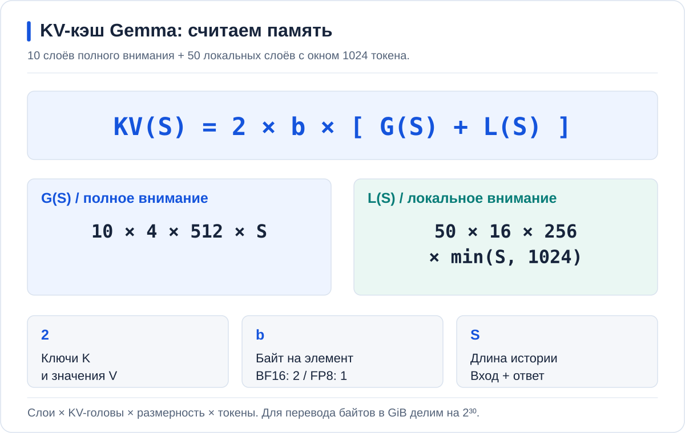

# Память для Gemma и Qwen

Опубликованные профили рассчитаны на узел с 128 GiB RAM и двумя H100.
Веса обеих Gemma остаются в GPU. RAM расходуется на процессы vLLM, загрузку весов,
компиляцию, межпроцессный обмен и, в отдельном опыте, CPU KV-кэш.

## Лимиты профилей

| Режим | requests RAM | limits RAM | /dev/shm | CPU requests |
| --- | ---: | ---: | ---: | ---: |
| A | 24 GiB | 48 GiB | 8 GiB | 4 |
| B, 64K или 128K без offload | 24 GiB | 48 GiB | 8 GiB | 4 |
| B, 128K и CPU KV 32 GiB | 56 GiB | 80 GiB | 40 GiB | 4 |

A + B без offload: 48 GiB requests и 96 GiB limits. На узле 128 GiB
арифметический остаток после лимитов — 32 GiB; он не целиком свободен:
нужны RAM ядру, Kubernetes и соседним Pod. Проверяйте allocatable и MemAvailable.

A + B с offload дали бы 48 + 80 = 128 GiB limits, без запаса.
Поэтому перед опытом с RAM **A останавливается**. У B остаётся limit 80 GiB.
Эти числа — ограничения и план размещения, не замер постоянного расхода.

При увеличении CPU KV на X GiB одновременно увеличиваются requests, limits и
shmSize на X GiB. Helm не пересчитывает их автоматически: меняйте все значения
в одном коммите после расчёта памяти узла.

## Загрузка весов и shared memory

Для закреплённой ревизии Gemma файлы safetensors занимают 62 546 338 248 байт,
или 58,25 GiB, включая мультимодальные веса. Это размер файлов, не обязательная
постоянная копия в RAM и не точное потребление HBM.

В профилях задан `safetensors-load-strategy: lazy`: загрузчик отображает файлы
в память, файловые страницы могут освобождаться. Поэтому лимит 48 GiB меньше
размера файлов, но загрузка требует проверки пиков cgroup и OOM.
Сначала загружайте A и проверяйте ответ, затем B.
[Загрузчик vLLM 0.30.0](https://github.com/vllm-project/vllm/blob/v0.30.0/vllm/model_executor/model_loader/weight_utils.py#L800).

CPU KV размещается в mmap-файле в `/dev/shm`. Для 32 GiB кэша выделен tmpfs
40 GiB: 32 GiB плюс 8 GiB служебного запаса. Это вместимость tmpfs, не
немедленное выделение 40 GiB. Использованные страницы уже входят в лимит
контейнера; складывать 32 GiB KV и 40 GiB shm как два расхода нельзя.
[SharedOffloadRegion](https://github.com/vllm-project/vllm/blob/v0.30.0/vllm/v1/kv_offload/cpu/shared_offload_region.py#L64).

## Проверка на своём узле

```bash
kubectl --context "$GPU_CONTEXT" describe node YOUR_GPU_NODE
kubectl --context "$GPU_CONTEXT" -n hardfest-demo top pods
kubectl --context "$GPU_CONTEXT" -n hardfest-demo get events --sort-by=.lastTimestamp
kubectl --context "$GPU_CONTEXT" -n hardfest-demo exec deployment/hf-gemma-b -- \
  sh -c 'cat /proc/meminfo; cat /sys/fs/cgroup/memory.current; cat /sys/fs/cgroup/memory.stat; cat /sys/fs/cgroup/memory.events; df -h /dev/shm'
```

Проверка cgroup рассчитана на v2. `/proc/meminfo` в контейнере обычно показывает
память узла, а не лимит Pod. Фиксируйте anon, file, shmem, события OOM и пики
во время загрузки и нагрузки. `kubectl top` не заменяет их.

В опыте вытеснения CPU-кэш должен сохранять данные, которые уже не помещаются
в GPU KV-пул. Сопоставьте 32 GiB с фактическим GPU-пулом из логов и проверьте
возврат байтов. Само выделение RAM ещё не доказывает полезный cache hit.

## KV для Gemma

Параметры берём из [закреплённого config.json](https://huggingface.co/google/gemma-4-31B-it/blob/842da3794eaa0b77d5f08bae87a17459d91ff475/config.json):

- 10 слоёв полного внимания: 4 KV-головы, размерность 512;
- 50 слоёв локального внимания: 16 KV-голов, размерность 256, окно 1024;
- общий контекст до 262 144 токенов; KV между слоями не разделяется.

Для одной независимой истории длиной `S`, при `b` байтах на элемент:



Двойка означает K и V. Флаг `attention_k_eq_v` в checkpoint не позволяет убрать её: выбранная реализация vLLM сохраняет оба тензора. [Обработка Gemma в vLLM](https://github.com/vllm-project/vllm/blob/v0.30.0/vllm/model_executor/models/gemma4.py#L513).

| Вход + выход | BF16, 2 байта | FP8, 1 байт |
| --- | ---: | ---: |
| 131 072 + 2 048 | 10,9375 GiB | 5,46875 GiB |
| Всего 262 144 | 20,78125 GiB | 10,390625 GiB |

Проверить числа без кластера:

```bash
awk 'BEGIN { for (s=133120; s<=262144; s+=129024) { bf16=(81920*s+16384*50*1024)/1024^3; print s,"tokens:",bf16,"GiB BF16;",bf16/2,"GiB FP8" } }'
```

Это полезные данные активного KV при сохранении только локального окна. Формула не учитывает выравнивание блоков, устройство гибридного пула, временное выделение во время prefill и историю блоков, сохраняемых offload-коннектором. Деление бюджета RAM на число из таблицы не даёт гарантированного количества сохранённых или одновременно работающих сессий.

Для восьми независимых историй по 133 120 токенов даже FP8 даёт 43,75 GiB активного KV. Его нужно сопоставить с реальным GPU KV-пулом после весов, буферов и графов. RAM-кэш не превращает эту память в дополнительную HBM для вычислений. [Как работает OffloadingConnector](https://docs.vllm.ai/en/v0.30.0/features/kv_offloading_usage/).

## Qwen TP2 после Gemma

Qwen занимает обе H100 одним сервисом. Перед запуском освобождаются обе карты:
ручные A/B и платформенная Gemma, если она ещё работает. Их лимиты не складываются
с лимитом Qwen: это последовательные этапы.

В [профиле Qwen](../values/qwen-tp2.yaml) для узла с 16 vCPU и 128 GiB RAM заложено:

| Параметр | Значение | Как учитывать |
| --- | ---: | --- |
| CPU request | 12 | Сопоставить с allocatable и заявками остальных Pod |
| RAM request / limit | 80 / 104 GiB | План размещения и верхняя граница контейнера, не замер |
| CPU KV | 16 GiB | Общий бюджет offload для TP2, не 16 GiB на каждую карту |
| `/dev/shm` | 24 GiB | Вместимость tmpfs: KV плюс 8 GiB служебного запаса |
| Safetensors на диске | 123,57 GiB | 132 680 249 378 байт из `models.lock.json`, не размер постоянной копии в RAM |

В vLLM 0.30.0 размер CPU-пула считается с учётом всех TP ranks. Поэтому
`cpu_bytes_to_use: 17179869184` не надо умножать на два.
Использованные страницы shared memory уже входят в 104 GiB; прибавлять к этому
лимиту ещё 16 GiB кэша и 24 GiB tmpfs нельзя.
[Расчёт CPU-пула](https://github.com/vllm-project/vllm/blob/v0.30.0/vllm/v1/kv_offload/cpu/spec.py#L97),
[общая mmap-область](https://github.com/vllm-project/vllm/blob/v0.30.0/vllm/v1/kv_offload/cpu/shared_offload_region.py#L64).

Арифметически после limit остаётся `128 − 104 = 24 GiB`. Часть этого остатка
нужна ОС, kubelet и другим Pod. Условие размещения — достаточно **allocatable**
для requests; условие устойчивости — достаточно реальной RAM на пиках загрузки
и работы. Проверяются оба, не только сумма лимитов.

`safetensors-load-strategy: lazy` позволяет загружать отображённые файловые
страницы по мере обращения. Это объясняет, почему размер checkpoint на диске
может быть больше лимита RAM, но не гарантирует успешный старт: остаются временные
буферы, компиляция, MTP и служебные процессы. На 64 GiB такой профиль не рассчитан.
Если платформа формирует другие requests, limits или shm, сначала исправьте рецепт
и пересчитайте бюджет, затем запускайте нагрузку.

Формула Gemma выше к Qwen неприменима: у закреплённой модели другая гибридная
архитектура внимания. Свободную HBM для KV берём из логов **запущенного** движка
после размещения весов, графов и MTP, а не вычитаем размер safetensors из суммы
памяти двух карт. Расчёт контекста и проверка числа сессий — в
[главе о Qwen](chapters/05-qwen.md).

Дальше: [порядок развёртывания и проверки](DEPLOYMENT.md).
